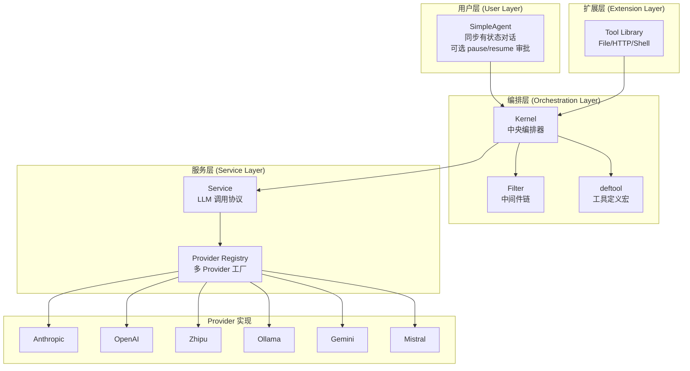
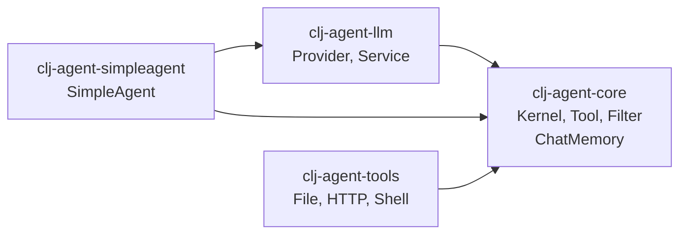

# clj-agent

Clojure AI Agent Framework - Kernel 中央编排器

[English](README_EN.md) | 中文

## 目录

- [项目概述](#项目概述)
- [架构概览](#架构概览)
- [模块结构](#模块结构)
- [快速开始](#快速开始)
  - [SimpleAgent（推荐入门）](#方式一simpleagent推荐入门)
  - [SimpleAgent + 敏感工具审批](#方式二simpleagent--敏感工具审批)
  - [Kernel API（完全控制）](#方式三kernel-api完全控制)
- [核心概念](#核心概念)
  - [deftool 宏](#deftool-宏)
  - [Kernel API](#kernel-api)
  - [Service 接口](#service-接口)
  - [Advisor 中间件](#advisor-中间件洋葱式-around对标-spring-ai-advisor)
  - [Context（共享状态）](#context共享状态)
- [LLM Provider](#llm-provider)
- [开发](#开发)
- [依赖](#依赖)

---

## 项目概述

`clj-agent` 是一个 Clojure AI Agent 框架，提供从简单对话到工具调用的完整解决方案：

- **Kernel + Tool 编排**：`deftool` 宏定义工具，Kernel 通过 `add-tools` 统一调度
- **多级 Invoke API**：`invoke-tool`（函数调用）、`invoke-chat`（纯 LLM）、`invoke`（工具调用循环）
- **Advisor 中间件**：洋葱式 around 链（对标 Spring AI Advisor），:chat / :tool 两类，可短路/重试/计时
- **Service 抽象**：LLM 服务通过 `{:chat-fn :build-result-msgs}` map 接入，无耦合
- **多 Provider 支持**：Anthropic、OpenAI、Zhipu、Ollama、Gemini、Mistral 及 OpenAI 兼容协议
- **SimpleAgent 封装**：同步有状态对话，可选 pause/resume 敏感工具审批
- **ChatMemory**：按 conversation-id 持久化对话历史（in-memory / windowed / SQLite）

## 架构概览



## 模块依赖关系



## 模块结构

```
clj-agent/
├── modules/
│   ├── clj-agent-core/         # 核心（Kernel, Tool, Filter, deftool, ChatMemory）
│   ├── clj-agent-llm/          # LLM Provider + Service 工厂
│   ├── clj-agent-simpleagent/  # 高级 Agent 封装（SimpleAgent）
│   └── clj-agent-tools/       # 预置插件库（File, HTTP, Shell, Security）
├── examples/                   # 使用示例
├── docs/                       # 设计文档
├── scripts/                    # 开发脚本
└── deps.edn                    # 根依赖配置
```

## 快速开始

### 在项目中使用（不发布到 Clojars）

#### 方式 A：本地路径依赖（推荐开发时使用）

在你的项目 `deps.edn` 中使用 `:local/root` 直接引用本地路径：

```clojure
;; deps.edn - 引用整个项目
{:deps {im.ttalk/clj-agent {:local/root "/path/to/clj-agent"}}}

;; 或者只引用特定模块
{:deps {im.ttalk/clj-agent-core {:local/root "/path/to/clj-agent/modules/clj-agent-core"}
        im.ttalk/clj-agent-llm  {:local/root "/path/to/clj-agent/modules/clj-agent-llm"}}}
```

#### 方式 B：Git 依赖（推荐团队协作）

如果项目已推送到 Git 仓库（GitHub/GitLab 等）：

```clojure
;; deps.edn - 使用 commit SHA
{:deps {im.ttalk/clj-agent {:git/url "https://github.com/your-org/clj-agent"
                            :git/sha "d523507"}}}

;; 使用 tag
{:deps {im.ttalk/clj-agent {:git/url "https://github.com/your-org/clj-agent"
                            :git/tag "v0.1.0"
                            :git/sha "d523507"}}}
```

#### 方式 C：安装到本地 Maven 仓库

先打包并安装到 `~/.m2/repository`：

```bash
cd /path/to/clj-agent/modules/clj-agent-core
clj -T:build jar      # 打包
clj -T:build install  # 安装到本地 Maven 仓库
```

然后像普通 Maven 依赖一样引用：

```clojure
;; deps.edn
{:deps {im.ttalk/clj-agent-core {:mvn/version "0.1.xxx"}}}
```

> **建议**：本地开发调试用方式 A，团队共享或 CI/CD 用方式 B，需要离线使用或与 Maven 生态集成用方式 C。

### 方式一：SimpleAgent（推荐入门）

最简单的使用方式，自动管理对话状态：

```clojure
(require '[im.ttalk.agent.simpleagent :as ka])
(require '[im.ttalk.agent.core.kernel.tool :refer [deftool]])
(require '[im.ttalk.agent.llm.factory.builder :as factory])

;; 1. 定义工具
(deftool get-weather
  "获取天气信息"
  [[city :string "城市名称"]]
  (str city ": 晴天 25°C"))

;; 2. 创建工具集（tool var 向量）
(def my-tools [#'get-weather])

;; 3. 创建 Provider
(def provider (factory/create-provider-from-env :openai))

;; 4. 创建 Agent
(def agent (ka/create-agent
             {:provider provider
              :model "gpt-4"
              :system-prompt "你是一个天气助手"
              :tools my-tools}))

;; 5. 对话（自动累积上下文）
(println (:text (ka/chat agent "北京天气怎么样？")))
(println (:text (ka/chat agent "上海呢？")))  ;; 自动记住上下文

;; 重置对话
(ka/reset! agent)
```

### 方式二：SimpleAgent + 敏感工具审批

SimpleAgent 配置 `:on-pause` 即启用 pause/resume：遇到标记为 `:sensitive` 的工具时自动暂停，等待人工审批：

```clojure
(require '[im.ttalk.agent.simpleagent :as ka])

(deftool delete-file
  "删除文件"
  [[path :string "文件路径"]]
  {:sensitive true}   ;; 标记为敏感操作
  (str "已删除: " path))

(def file-tools [#'delete-file])

(def agent (ka/create-agent
             {:provider provider
              :model "gpt-4"
              :tools file-tools
              :on-pause (fn [{:keys [reason]}]
                          (println "需要审批:" reason))}))   ;; 配置即启用 pause/resume

(let [result (ka/chat agent "删除 /tmp/test.txt")]
  (when (= :paused (:status result))
    (println "待审批工具:" (get-in result [:pending-tool :name]))
    ;; 审批通过
    (ka/resume agent "approved")
    ;; 或拒绝: (ka/resume agent "rejected")
    ))
```

### 方式三：Kernel API（完全控制）

直接使用 Kernel 获取最大灵活性：

```clojure
(require '[im.ttalk.agent.core.kernel :as kernel])
(require '[im.ttalk.agent.core.kernel.filter :as filters])
(require '[im.ttalk.agent.llm.kernel.chat :as chat])

;; 创建 LLM Service
(def service (chat/create-service
               {:provider provider
                :model "gpt-4"
                :max-tokens 4096}))

;; 构建 Kernel（kernel 只提供原语：invoke-chat / invoke-tool）
(def app-kernel
  (-> (kernel/create-kernel-builder)
      (kernel/add-service service)
      (kernel/add-tools my-tools)
      (kernel/add-filter filters/logging-tool-advisor)
      (kernel/build-kernel)))

;; 纯 LLM 调用（经 :chat advisor 链，不触发工具）
(let [{:keys [response]} (kernel/invoke-chat app-kernel
                           [{:role "user" :content "你好"}]
                           {})]
  (println (:text response)))

;; 单独调用工具（经 :tool advisor 链）
(let [{:keys [value]} (kernel/invoke-tool app-kernel :get-weather
                        {:city "北京"} nil)]
  (println value))

;; 完整的「工具调用循环」是 SimpleAgent 的职责（见上文方式一），不在 kernel：
;; (require '[im.ttalk.agent.simpleagent :as agent])
;; (agent/chat (agent/create-agent {:provider provider :tools my-tools}) "北京天气怎么样？")
```

## 核心概念

### deftool 宏

同时定义 Clojure 函数和生成 LLM tool schema：

```clojure
(deftool fn-name
  "描述（会作为 LLM 的 tool description）"
  [[param1 :string "参数描述"]
   [param2 :int "可选参数" :default 10]
   [param3 :boolean "布尔参数"]]
  {:sensitive true    ;; 可选：标记为敏感操作（SimpleAgent 配置 :on-pause 时会暂停审批）
   :context true}     ;; 可选：需要访问 Context（函数签名多一个 ctx 参数）
  (body ...))

;; 支持的参数类型: :string :int :float :boolean :array :object
```

### Kernel API

Kernel 提供三类 API：

```clojure
;; Build API - 构建 Kernel
(-> (kernel/create-kernel-builder)
    (kernel/add-tools my-tools)         ;; 添加工具
    (kernel/add-service service)        ;; 设置 LLM 服务
    (kernel/add-filter filter-def)      ;; 添加 Filter
    (kernel/build-kernel))              ;; 构建

;; Invoke API - 调用（两个原语，均经 advisor 洋葱链）
(kernel/invoke-tool kernel :fn-name {:arg "val"} context)  ;; 调用函数（:tool 链）
(kernel/invoke-chat kernel messages opts)                   ;; 纯 LLM（:chat 链，不含工具循环）
;; 工具调用循环不在 kernel —— 见 im.ttalk.agent.simpleagent（create-agent + chat）

;; Query API - 查询
(:tools kernel)                       ;; 所有 tool schema
(:service kernel)                     ;; 获取 service
(kernel/find-function kernel :name)   ;; 查找函数
(kernel/list-functions kernel)        ;; 列出所有函数名
```

### Service 接口

Service 是一个 map，定义 LLM 调用协议：

```clojure
{:chat-fn           (fn [messages opts] -> {:text "..." :tool-calls [...] :assistant-msg {...}})
 :build-result-msgs (fn [assistant-msg tool-results] -> [msg1 msg2 ...])}
```

`clj-agent-llm` 模块的 `chat/create-service` 可自动创建。也可自行实现此 map 接入任意 LLM。

### Advisor 中间件（洋葱式 around，对标 Spring AI Advisor）

根抽象是 `advise-call(req, chain)`：chain 是下游，由 advisor 决定调不调、调几次、前后干什么
（可短路 / 重试 / 计时）。`before`/`after` 是只改写请求/响应的语法糖。

```clojure
;; 自定义 advisor —— around（拿到 chain）
(filters/create-advisor :my-advisor :tool :order 10
  :advise-call (fn [req chain]
                 (println "工具调用前:" (get-in req [:function :name]))
                 (chain req)))         ;; 不调 chain 即短路

;; 或只改写（糖）
(filters/create-advisor :inject :chat :order 0
  :before (fn [req] (update req :messages conj sys-msg)))

;; 内置 tool advisor
filters/logging-tool-advisor        ;; 调用前后日志
(filters/timeout-tool-advisor 5000) ;; 超时控制（ms，around）
(filters/approval-tool-advisor)     ;; 敏感工具审批（拒绝则短路）

;; phase：:chat（invoke-chat，terminal 调 LLM）| :tool（invoke-tool，terminal 调函数）
;; order：越小越靠外层（最先 before、最后 after）
```

### Context（共享状态）

Context 管理对话中的共享状态：

```clojure
(require '[im.ttalk.agent.core.kernel.context :as ctx])

(def my-ctx (ctx/create {:user-id "u123"}))   ;; 创建（可带初始变量）
(ctx/get-var my-ctx :user-id)                  ;; 获取变量
(ctx/set-var my-ctx :key "value")              ;; 设置变量（返回新 ctx）
(ctx/get-messages my-ctx)                      ;; 获取工作消息
(ctx/get-history my-ctx)                       ;; 获取完整历史
(ctx/track-message my-ctx msg)                 ;; 追踪消息（返回新 ctx）
```

## LLM Provider

### 支持的 Provider

| Provider | 说明 | 环境变量 | 推荐模型 |
|----------|------|----------|----------|
| `:openai` | OpenAI GPT 系列 | `OPENAI_API_KEY` | gpt-4, gpt-4-turbo, gpt-3.5-turbo |
| `:anthropic` | Anthropic Claude 系列 | `ANTHROPIC_API_KEY` | claude-3-opus, claude-3-sonnet |
| `:zhipu` | 智谱 GLM 系列 | `ZHIPU_API_KEY` | glm-4, glm-4-plus |
| `:ollama` | 本地 Ollama 模型 | - | llama2, mistral, codellama |
| `:gemini` | Google Gemini | `GEMINI_API_KEY` | gemini-pro, gemini-ultra |
| `:mistral` | Mistral | `MISTRAL_API_KEY` | mistral-large, mistral-medium |
| `:openai-compat` | OpenAI 兼容协议 | 自定义 | 取决于后端 |

### 创建 Provider

```clojure
(require '[im.ttalk.agent.llm.factory.builder :as factory])

;; 方式 1: 从环境变量自动配置（推荐）
(def provider (factory/create-provider-from-env :openai))

;; 方式 2: 手动指定配置
(def provider (factory/create-provider :anthropic
                {:api-key "sk-..."
                 :base-url "https://api.anthropic.com"}))

;; 方式 3: OpenAI 兼容协议（vLLM、LocalAI、LM Studio 等）
(def provider (factory/create-provider :openai-compat
                {:api-key "key"
                 :base-url "http://localhost:8000/v1"}))

;; 方式 4: 智谱 GLM（国产大模型）
(require '[im.ttalk.agent.llm.provider.zhipu :as zhipu])
(def provider (zhipu/create-provider
                {:api-key (System/getenv "ZHIPU_API_KEY")
                 :base-url "https://open.bigmodel.cn/api/paas/v4"}))

;; 方式 5: 本地 Ollama
(require '[im.ttalk.agent.llm.provider.ollama :as ollama])
(def provider (ollama/create-provider
                {:base-url "http://localhost:11434"}))
```

### 直接调用 Provider

```clojure
(require '[im.ttalk.agent.core.kernel.provider :as proto])

;; 简单对话
(proto/call-simple provider
  {:model "gpt-4" :max-tokens 1024}
  [{:role "user" :content "你好"}])
;; => "你好！有什么我可以帮助你的吗？"

;; 带工具的调用
(proto/call-with-tools provider
  {:model "gpt-4" :max-tokens 1024}
  [{:role "user" :content "北京天气怎么样？"}]
  [{:name "get-weather" :description "获取天气" :parameters {...}}])
;; => {:text "..." :tool-calls [{:id "..." :name :get-weather :input {:city "北京"}}]}
```

## 高级用法：完整示例

### 多 Agent 协作

```clojure
;; 创建专业化 Agent
(def researcher (ka/create-agent
                  {:provider provider
                   :model "gpt-4"
                   :tools [web-search-plugin]
                   :system-prompt "你是研究员，负责查找和整理信息。"}))

(def writer (ka/create-agent
              {:provider provider
               :model "gpt-4"
               :tools []
               :system-prompt "你是写作专家，负责将信息整理成文章。"}))

;; 协作流程
(defn research-and-write [topic]
  (let [;; 研究员收集信息
        research-result (ka/chat researcher (str "研究主题: " topic))
        facts (:text research-result)
        ;; 将研究结果传给写作者
        article (ka/chat writer (str "基于以下信息写一篇文章:\n" facts))]
    (:text article)))
```

## 开发

```bash
# 运行所有测试
./scripts/test-all.sh

# 构建所有模块
./scripts/build-all.sh

# 安装到本地 Maven
./scripts/install-all.sh
```

## 依赖

核心依赖：

- org.clojure/clojure 1.11.4
- cheshire/cheshire 5.12.0
- com.taoensso/timbre 6.3.0
- http-kit/http-kit 2.8.0
- net.clojars.wkok/openai-clojure 0.21.0

持久化 ChatMemory（SQLite 后端，按需引入 `im.ttalk.agent.simpleagent.memory.sqlite`）：

- com.github.seancorfield/next.jdbc 1.3.939
- org.xerial/sqlite-jdbc 3.45.1.0

测试：

- lambdaisland/kaocha 1.85.1342

## 许可证

MIT License
