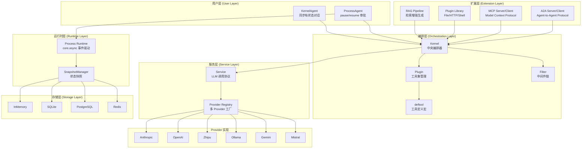
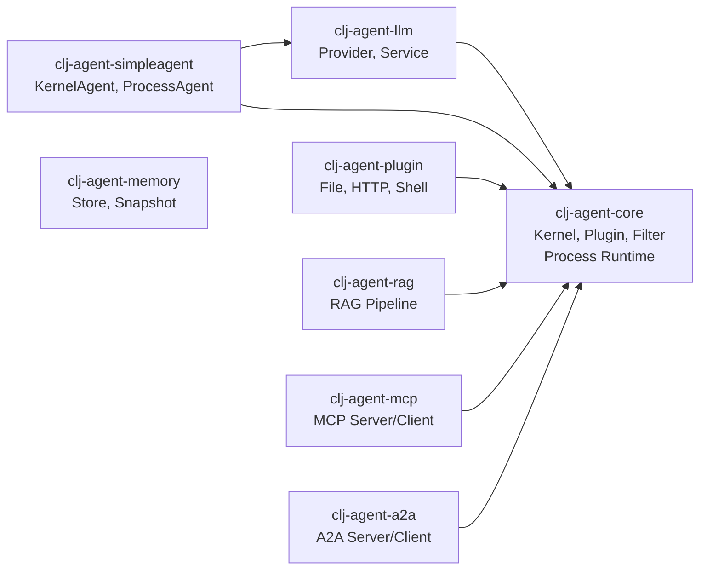

# clj-agent

Clojure AI Agent Framework - Kernel 中央编排器

[English](README_EN.md) | 中文

## 目录

- [项目概述](#项目概述)
- [架构概览](#架构概览)
- [模块结构](#模块结构)
- [快速开始](#快速开始)
  - [SimpleAgent（推荐入门）](#方式一simpleagent推荐入门)
  - [ProcessAgent（敏感工具审批）](#方式二processagent支持敏感工具审批)
  - [Kernel API（完全控制）](#方式三kernel-api完全控制)
- [核心概念](#核心概念)
  - [deftool 宏](#deftool-宏)
  - [defplugin 宏](#defplugin-宏)
  - [Kernel API](#kernel-api)
  - [Service 接口](#service-接口)
  - [Filter 中间件](#filter-中间件)
  - [Context（共享状态）](#context共享状态)
- [LLM Provider](#llm-provider)
- [Process 运行时](#process-运行时)
- [Memory 存储](#memory-存储)
  - [基础存储操作](#基础存储操作)
  - [Agent 对话状态保存与恢复](#agent-对话状态保存与恢复)
  - [AgentMemory 统一封装](#agentmemory-统一封装)
  - [长期记忆类型](#长期记忆类型)
- [RAG 检索增强生成](#rag-检索增强生成)
- [MCP 协议](#mcp-协议)
- [开发](#开发)
- [依赖](#依赖)

---

## 项目概述

`clj-agent` 是一个 Clojure AI Agent 框架，提供从简单对话到复杂工作流的完整解决方案：

- **Kernel + Plugin 编排**：`deftool` 宏定义工具，`defplugin` 组织工具集，Kernel 统一调度
- **多级 Invoke API**：`invoke-tool`（函数调用）、`invoke-chat`（纯 LLM）、`invoke`（工具调用循环）
- **Filter 中间件**：Ring-style 洋葱模型，支持 pre/post invocation 和 pre/post chat 四类拦截
- **Service 抽象**：LLM 服务通过 `{:chat-fn :build-result-msgs}` map 接入，无耦合
- **多 Provider 支持**：Anthropic、OpenAI、Zhipu、Ollama、Gemini、Mistral 及 OpenAI 兼容协议
- **SimpleAgent 封装**：KernelAgent（同步有状态）和 ProcessAgent（支持 pause/resume 审批）
- **Process 运行时**：基于 core.async 的事件驱动工作流，支持并行、扇入扇出、人工审批
- **多后端存储**：IKeyValueStore + ISnapshotStore 协议（Memory/SQLite/Redis/PostgreSQL）
- **RAG 支持**：检索增强生成，文档切分、向量存储、语义检索
- **MCP 协议**：Model Context Protocol 服务端和客户端实现
- **A2A 协议**：Agent-to-Agent Protocol 服务端和客户端实现

## 架构概览



## 模块依赖关系



> `clj-agent-memory` 是独立模块，不依赖其他内部模块。

## 模块结构

```
clj-agent/
├── modules/
│   ├── clj-agent-core/         # 核心（Kernel, Plugin, Filter, deftool, Process Runtime）
│   ├── clj-agent-llm/          # LLM Provider + Service 工厂
│   ├── clj-agent-simpleagent/  # 高级 Agent 封装（KernelAgent, ProcessAgent）
│   ├── clj-agent-plugin/       # 预置插件库（File, HTTP, Shell, Security）
│   ├── clj-agent-memory/       # 存储实现（InMemory, SQLite, Redis, PostgreSQL）
│   ├── clj-agent-rag/          # RAG 检索增强生成
│   ├── clj-agent-mcp/          # MCP 服务器/客户端
│   └── clj-agent-a2a/          # A2A 服务器/客户端
├── examples/                   # 使用示例
├── docs/                       # 设计文档
├── scripts/                    # 开发脚本
└── deps.edn                    # 根依赖配置
```

## 快速开始

### 在项目中使用

```clojure
;; deps.edn
{:deps {im/ttalk-agent {:local/root "/path/to/clj-agent"}}}
```

### 方式一：SimpleAgent（推荐入门）

最简单的使用方式，自动管理对话状态：

```clojure
(require '[im.ttalk.agent.simpleagent.kernel-agent :as ka])
(require '[im.ttalk.agent.core.kernel.tool :refer [deftool]])
(require '[im.ttalk.agent.core.kernel.plugin :as kp])
(require '[im.ttalk.agent.llm.factory.builder :as factory])

;; 1. 定义工具
(deftool get-weather
  "获取天气信息"
  [[city :string "城市名称"]]
  (str city ": 晴天 25°C"))

;; 2. 创建 Plugin
(kp/defplugin my-tools "工具集" get-weather)

;; 3. 创建 Provider
(def provider (factory/create-provider-from-env :openai))

;; 4. 创建 Agent
(def agent (ka/create-agent
             {:provider provider
              :model "gpt-4"
              :system-prompt "你是一个天气助手"
              :tools [my-tools]}))

;; 5. 对话（自动累积上下文）
(println (:text (ka/chat agent "北京天气怎么样？")))
(println (:text (ka/chat agent "上海呢？")))  ;; 自动记住上下文

;; 重置对话
(ka/reset! agent)
```

### 方式二：ProcessAgent（支持敏感工具审批）

遇到标记为 `:sensitive` 的工具时自动暂停，等待人工审批：

```clojure
(require '[im.ttalk.agent.simpleagent.process-agent :as pa])

(deftool delete-file
  "删除文件"
  [[path :string "文件路径"]]
  {:sensitive true}   ;; 标记为敏感操作
  (str "已删除: " path))

(kp/defplugin file-tools "文件操作" delete-file)

(def agent (pa/create-process-agent
             {:provider provider
              :model "gpt-4"
              :tools [file-tools]
              :on-pause (fn [{:keys [reason]}]
                          (println "需要审批:" reason))}))

(let [result (pa/chat agent "删除 /tmp/test.txt")]
  (when (= :paused (:status result))
    (println "待审批工具:" (get-in result [:pending-tool :name]))
    ;; 审批通过
    (pa/resume agent "approved")
    ;; 或拒绝: (pa/resume agent "rejected")
    ))
```

### 方式三：Kernel API（完全控制）

直接使用 Kernel 获取最大灵活性：

```clojure
(require '[im.ttalk.agent.core.kernel.core :as kernel])
(require '[im.ttalk.agent.core.kernel.filter :as filters])
(require '[im.ttalk.agent.llm.kernel.chat :as chat])

;; 创建 LLM Service
(def service (chat/create-service
               {:provider provider
                :model "gpt-4"
                :max-tokens 4096}))

;; 构建 Kernel
(def app-kernel
  (-> (kernel/create-kernel-builder)
      (kernel/add-service service)
      (kernel/add-plugin my-tools)
      (kernel/add-filter filters/logging-pre-filter)
      (kernel/add-filter filters/error-handling-filter)
      (kernel/build-kernel)))

;; 工具调用循环（自动 LLM + Tool 交互）
(let [messages [{:role "user" :content "北京天气怎么样？"}]
      result (kernel/invoke app-kernel messages {})]
  (println (get-in result [:response :text]))
  (println "调用的工具:" (:tool-calls-made result)))

;; 纯 LLM 调用（不触发工具）
(let [{:keys [response]} (kernel/invoke-chat app-kernel
                           [{:role "user" :content "你好"}]
                           {})]
  (println (:text response)))

;; 单独调用工具（经过 Filter 管道）
(let [{:keys [value]} (kernel/invoke-tool app-kernel :get-weather
                        {:city "北京"} nil)]
  (println value))
```

## 核心概念

### deftool 宏

同时定义 Clojure 函数和生成 LLM tool schema：

```clojure
(deftool fn-name
  "描述（会作为 LLM 的 tool description）"
  [[param1 :string "参数描述"]
   [param2 :int "可选参数" :default 10]
   [param3 :boolean "布尔参数"]]
  {:sensitive true    ;; 可选：标记为敏感操作（ProcessAgent 会暂停审批）
   :context true}     ;; 可选：需要访问 Context（函数签名多一个 ctx 参数）
  (body ...))

;; 支持的参数类型: :string :int :float :boolean :array :object
```

### defplugin 宏

将工具组织为命名集合：

```clojure
(kp/defplugin weather-tools
  "天气相关工具"
  get-weather get-forecast)

;; 或使用函数式 API
(kp/create-plugin :weather-tools "天气工具" [#'get-weather #'get-forecast])
```

### Kernel API

Kernel 提供三类 API：

```clojure
;; Build API - 构建 Kernel
(-> (kernel/create-kernel-builder)
    (kernel/add-plugin my-plugin)       ;; 添加插件
    (kernel/add-service service)        ;; 设置 LLM 服务
    (kernel/add-filter filter-def)      ;; 添加 Filter
    (kernel/build-kernel))              ;; 构建

;; Invoke API - 调用
(kernel/invoke-tool kernel :fn-name {:arg "val"} context)  ;; 调用函数（经过 Filter）
(kernel/invoke-chat kernel messages opts)                   ;; 纯 LLM（不含工具循环）
(kernel/invoke kernel messages opts)                        ;; 工具调用循环（主入口）

;; Query API - 查询
(:tools kernel)                       ;; 所有 tool schema
(:service kernel)                     ;; 获取 service
(kernel/find-function kernel :name)   ;; 查找函数
(kernel/list-functions kernel)        ;; 列出所有函数名
```

### Service 接口

Service 是一个 map，定义 LLM 调用协议：

```clojure
{:chat-fn           (fn [messages opts] -> {:text "..." :tool-calls [...] :assistant-msg {...}})
 :build-result-msgs (fn [assistant-msg tool-results] -> [msg1 msg2 ...])}
```

`clj-agent-llm` 模块的 `chat/create-service` 可自动创建。也可自行实现此 map 接入任意 LLM。

### Filter 中间件

四种类型的 Filter，Ring-style 洋葱模型：

```clojure
;; 创建自定义 Filter
(filters/create-filter :my-filter :pre-invocation
  (fn [filter-ctx]
    (println "工具调用前:" (:tool-name filter-ctx))
    {:action :continue :context filter-ctx})
  :priority 10)

;; 内置 Filter
filters/logging-pre-filter         ;; 调用前日志
filters/logging-post-filter        ;; 调用后日志
filters/error-handling-filter      ;; 异常捕获
(filters/timeout-filter 5000)      ;; 超时控制（ms）
filters/approval-filter            ;; 敏感工具审批

;; Filter 类型
;; :pre-invocation   工具调用前（可修改 args/context，可跳过执行）
;; :post-invocation  工具调用后（可修改 result/context）
;; :pre-chat         LLM 调用前（可修改 messages/context）
;; :post-chat        LLM 调用后（可修改 response/context）
```

### Context（共享状态）

Context 管理对话中的共享状态：

```clojure
(require '[im.ttalk.agent.core.kernel.context :as ctx])

(def my-ctx (ctx/create {:user-id "u123"}))   ;; 创建（可带初始变量）
(ctx/get-var my-ctx :user-id)                  ;; 获取变量
(ctx/set-var my-ctx :key "value")              ;; 设置变量（返回新 ctx）
(ctx/get-messages my-ctx)                      ;; 获取工作消息
(ctx/get-history my-ctx)                       ;; 获取完整历史
(ctx/track-message my-ctx msg)                 ;; 追踪消息（返回新 ctx）
```

## LLM Provider

### 支持的 Provider

| Provider | 说明 | 环境变量 | 推荐模型 |
|----------|------|----------|----------|
| `:openai` | OpenAI GPT 系列 | `OPENAI_API_KEY` | gpt-4, gpt-4-turbo, gpt-3.5-turbo |
| `:anthropic` | Anthropic Claude 系列 | `ANTHROPIC_API_KEY` | claude-3-opus, claude-3-sonnet |
| `:zhipu` | 智谱 GLM 系列 | `ZHIPU_API_KEY` | glm-4, glm-4-plus |
| `:ollama` | 本地 Ollama 模型 | - | llama2, mistral, codellama |
| `:gemini` | Google Gemini | `GEMINI_API_KEY` | gemini-pro, gemini-ultra |
| `:mistral` | Mistral | `MISTRAL_API_KEY` | mistral-large, mistral-medium |
| `:openai-compat` | OpenAI 兼容协议 | 自定义 | 取决于后端 |

### 创建 Provider

```clojure
(require '[im.ttalk.agent.llm.factory.builder :as factory])

;; 方式 1: 从环境变量自动配置（推荐）
(def provider (factory/create-provider-from-env :openai))

;; 方式 2: 手动指定配置
(def provider (factory/create-provider :anthropic
                {:api-key "sk-..."
                 :base-url "https://api.anthropic.com"}))

;; 方式 3: OpenAI 兼容协议（vLLM、LocalAI、LM Studio 等）
(def provider (factory/create-provider :openai-compat
                {:api-key "key"
                 :base-url "http://localhost:8000/v1"}))

;; 方式 4: 智谱 GLM（国产大模型）
(require '[im.ttalk.agent.llm.provider.zhipu :as zhipu])
(def provider (zhipu/create-provider
                {:api-key (System/getenv "ZHIPU_API_KEY")
                 :base-url "https://open.bigmodel.cn/api/paas/v4"}))

;; 方式 5: 本地 Ollama
(require '[im.ttalk.agent.llm.provider.ollama :as ollama])
(def provider (ollama/create-provider
                {:base-url "http://localhost:11434"}))
```

### 直接调用 Provider

```clojure
(require '[im.ttalk.agent.core.kernel.provider :as proto])

;; 简单对话
(proto/call-simple provider
  {:model "gpt-4" :max-tokens 1024}
  [{:role "user" :content "你好"}])
;; => "你好！有什么我可以帮助你的吗？"

;; 带工具的调用
(proto/call-with-tools provider
  {:model "gpt-4" :max-tokens 1024}
  [{:role "user" :content "北京天气怎么样？"}]
  [{:name "get-weather" :description "获取天气" :parameters {...}}])
;; => {:text "..." :tool-calls [{:id "..." :name :get-weather :input {:city "北京"}}]}
```

## Process 运行时

基于 core.async 的事件驱动工作流引擎，支持：

- 线性/并行/扇入扇出执行模式
- Human-in-the-loop 暂停/恢复
- 外部事件注入（交互式 Agent、webhook 回调）
- 安全快照点（on-quiescent 回调）
- Step 生命周期管理（init → can-activate? → on-activate → on-terminate）

```clojure
(require '[im.ttalk.agent.core.kernel.process.builder :as process])
(require '[im.ttalk.agent.core.kernel.process.runtime :as runtime])

;; 定义 Process
(def spec
  (-> (process/builder :document-gen)
      (process/add-step {:id :gather
                         :on-activate (fn [state ctx event]
                                        {:emit [{:target :generate
                                                 :data (:data event)}]})})
      (process/add-step {:id :generate
                         :on-activate (fn [state ctx event]
                                        {:result (generate-doc (:data event))})})
      (process/on-event :start :gather :input)
      (process/on-event :ready :generate :data)
      (process/build)))

;; 执行
(def result (runtime/run-process spec {:input {:topic "AI"}}))
```

### 外部事件支持

支持向运行中的 Process 注入外部事件，实现交互式场景（如对话 Agent、webhook 回调）：

```clojure
;; 构建带外部事件绑定的 Process
(def interactive-spec
  (-> (process/builder :chat)
      (process/add-step
        {:id :handler
         :on-activate (fn [inputs state ctx]
                        (if (= (:input inputs) "/quit")
                          {:terminate true}  ;; 终止信号
                          {:events [{:name :response :data "..."}]}))})
      (process/on-external-event :user-input :handler :input)
      (process/build)))

;; 异步启动（返回 ProcessHandle）
(def handle (runtime/start-process-async interactive-spec {}))

;; 发送外部事件
(runtime/send-event handle :user-input "Hello!")
(runtime/send-event handle :user-input "/quit")

;; 等待完成
(runtime/wait-for-completion handle)
```

详细设计参见 [docs/process-framework-design.md](docs/process-framework-design.md) 和 [docs/process-parallel-design.md](docs/process-parallel-design.md)。

## Memory 存储

多后端存储，用于对话历史、快照持久化、长短期记忆管理。

### 基础存储操作

```clojure
(require '[im.ttalk.agent.memory.api :as mem])

;; 创建存储后端
(def store (mem/create-in-memory-store))           ;; 内存（开发/测试）
(def store (mem/create-sqlite-store "agent.db"))   ;; SQLite（单机持久化）
(def store (mem/create-postgresql-store conn-opts)) ;; PostgreSQL（生产环境）
(def store (mem/create-redis-store redis-opts))    ;; Redis（分布式缓存）

;; Key-Value 操作
(mem/kv-put store "user-123" "preferences" {:lang "zh" :theme "dark"})
(mem/kv-get store "user-123" "preferences")
;; => {:lang "zh" :theme "dark"}

(mem/kv-list-keys store "preferences")
(mem/kv-exists? store "user-123" "preferences")
(mem/kv-delete store "user-123" "preferences")
```

### Agent 对话状态保存与恢复

使用 SnapshotManager 实现对话状态的持久化，支持断点续聊和时间旅行：

```clojure
(require '[im.ttalk.agent.simpleagent.kernel-agent :as ka])
(require '[im.ttalk.agent.memory.store.in-memory :as mem-store])
(require '[im.ttalk.agent.memory.snapshot.manager :as snap-mgr])
(require '[im.ttalk.agent.memory.protocol :as mem-proto])
(require '[im.ttalk.agent.core.kernel.context :as ctx])

;; 1. 创建 SnapshotManager
(def store (mem-store/create-in-memory-store))
(def snap-manager (snap-mgr/create-snapshot-manager store))
(def thread-id "session-001")

;; 2. 创建 Agent 并对话
(def agent (ka/create-agent
             {:provider provider
              :model "gpt-4"
              :system-prompt "你是助手。"}))

(ka/chat agent "我叫张三，在北京工作。")
(ka/chat agent "我的爱好是编程。")

;; 3. 保存当前对话状态
(let [context (ka/get-context agent)
      snapshot {:context context
                :settings {:model "gpt-4"}}]
  (mem-proto/snap-put snap-manager
                      {:thread-id thread-id}
                      snapshot
                      {:reason :user-save
                       :created-at (System/currentTimeMillis)}))

;; 4. 在新 Agent 中恢复状态（断点续聊）
(let [loaded (mem-proto/snap-get snap-manager {:thread-id thread-id})
      restored-context (:context (:snapshot loaded))
      new-agent (ka/create-agent {:provider provider :model "gpt-4"})]
  ;; 恢复 context
  (reset! (:context-atom new-agent) restored-context)
  ;; 继续对话，Agent 保持之前的记忆
  (ka/chat new-agent "我叫什么名字？"))
;; => Agent 记得用户叫张三
```

### AgentMemory 统一封装

AgentMemory 提供一站式记忆管理，集成快照、时间旅行、知识库和消息管理：

```clojure
(require '[im.ttalk.agent.memory.api :as mem])

;; 创建完整的记忆系统
(def am (mem/create-agent-memory
          {:context-store (mem/create-in-memory-store)      ;; 热数据
           :persistent-store (mem/create-sqlite-store "data.db")}))  ;; 冷数据

;; 状态管理
(mem/save-state am {:messages [...] :variables {...}})
(mem/load-state am)

;; 时间旅行
(mem/go-back am)           ;; 回退到上一状态
(mem/go-forward am)        ;; 前进到下一状态
(mem/goto am 3)            ;; 跳转到第 3 个版本
(mem/list-history am)      ;; 查看历史

;; 分支管理（A/B 测试、实验对话）
(mem/create-branch am "experiment-a")
(mem/switch-branch am "experiment-a")
(mem/list-branches am)

;; 知识库（长期记忆）
(mem/remember am {:type :fact :content "用户偏好中文"})
(mem/remember am {:type :episode :content "用户上次询问了天气"})
(mem/recall am "用户偏好")                    ;; 语义检索
(mem/recall-by-type am :fact)                 ;; 按类型检索
(mem/search-knowledge am "偏好" {:limit 5})   ;; 搜索

;; 消息管理
(mem/add-message-to-memory am {:role "user" :content "你好"})
(mem/get-messages-from-memory am)
(mem/clear-messages-from-memory am)

;; 会话归档
(mem/archive-session! am)
(mem/list-archived am)
(mem/load-archived am "session-id")
```

### 长期记忆类型

```clojure
;; 语义记忆（事实/知识）
(def sem (mem/create-semantic-memory store))
(mem/store-fact sem {:key "capital" :value "北京是中国首都" :category "geography"})
(mem/get-fact sem "capital")
(mem/query-facts sem {:category "geography"})
(mem/set-profile sem "user-123" {:name "张三" :lang "zh"})
(mem/get-profile sem "user-123")

;; 情景记忆（事件/经历）
(def epi (mem/create-episodic-memory store))
(mem/store-episode epi {:action "weather-query"
                        :query "北京天气"
                        :outcome :success
                        :timestamp (System/currentTimeMillis)})
(mem/get-recent-episodes epi 5)
(mem/get-successful-episodes epi)

;; 程序记忆（规则/技能）
(def proc (mem/create-procedural-memory store))
(mem/set-system-prompt proc "你是一个专业的助手")
(mem/get-system-prompt proc)
(mem/add-rule proc (mem/create-rule {:id "r1" :content "始终用中文回答"}))
(mem/get-active-rules proc)
```

### 一键创建完整记忆系统

```clojure
;; 快速创建包含所有组件的记忆系统
(def system (mem/create-memory-system
              :store-type :sqlite
              :store-opts {:db-path "agent.db"}))

;; system 包含：
;; - :store          KV 存储
;; - :snapshot-store 快照存储
;; - :vector-store   向量存储
;; - :embedder       Embedding 生成器
```

## RAG 检索增强生成

RAG 模块提供文档切分、向量存储和语义检索能力。

### 基础用法

```clojure
(require '[im.ttalk.agent.rag.plugin :as rag])

;; 索引文档
(rag/rag-index-text "Clojure 是一门函数式编程语言..." {:source "doc-001"})
(rag/rag-index-text "clj-agent 是一个 AI Agent 框架..." {:source "doc-002"})

;; 检索相关文档
(rag/rag-retrieve "什么是 Clojure" {:top-k 5})
;; => [{:content "Clojure 是一门函数式编程语言..." :score 0.92} ...]

;; 带 RAG 的问答（自动检索 + LLM 生成）
(rag/rag-query "clj-agent 有什么功能？" {:top-k 5})
;; => "clj-agent 是一个 AI Agent 框架，提供..."
```

### 作为 Kernel Plugin 使用

让 LLM 自动决定何时调用检索：

```clojure
(require '[im.ttalk.agent.rag.plugin :as rag-plugin])
(require '[im.ttalk.agent.simpleagent.kernel-agent :as ka])

;; 创建 RAG Plugin
(def rag-tools (rag-plugin/create-rag-plugin
                 {:vector-store vector-store
                  :embedder embedder}))

;; 将 RAG 作为工具提供给 Agent
(def agent (ka/create-agent
             {:provider provider
              :model "gpt-4"
              :tools [rag-tools]
              :system-prompt "你是知识库助手。需要查找资料时使用检索工具。"}))

(ka/chat agent "帮我查一下 clj-agent 的架构设计")
;; Agent 会自动调用 RAG 检索并基于结果回答
```

### 完整 RAG Pipeline

```clojure
(require '[im.ttalk.agent.memory.store.vector-memory :as vec-store])
(require '[im.ttalk.agent.memory.store.embedding :as embed])

;; 创建 Embedding 生成器
(def embedder (embed/create-openai-embedder
                {:api-key (System/getenv "OPENAI_API_KEY")
                 :model "text-embedding-3-small"}))

;; 创建向量存储
(def vector-store (vec-store/create-vector-store
                    {:embedder embedder
                     :store (mem/create-in-memory-store)}))

;; 批量索引文档
(doseq [doc documents]
  (vec-store/add-document vector-store
    {:id (:id doc)
     :content (:content doc)
     :metadata {:source (:source doc)}}))

;; 语义搜索
(vec-store/search vector-store "查询内容" {:top-k 10})
```

## 高级用法：完整示例

### 带持久化记忆的智能助手

一个完整的生产级 Agent 示例，包含工具调用、对话记忆持久化和知识库：

```clojure
(ns my-app.agent
  (:require [im.ttalk.agent.simpleagent.kernel-agent :as ka]
            [im.ttalk.agent.core.kernel.tool :refer [deftool]]
            [im.ttalk.agent.core.kernel.plugin :as kp]
            [im.ttalk.agent.core.kernel.context :as ctx]
            [im.ttalk.agent.llm.factory.builder :as factory]
            [im.ttalk.agent.memory.api :as mem]
            [im.ttalk.agent.memory.store.sqlite :as sqlite]
            [im.ttalk.agent.memory.snapshot.manager :as snap-mgr]
            [im.ttalk.agent.memory.protocol :as mem-proto]))

;;; 1. 定义工具
(deftool search-knowledge
  "在知识库中搜索相关信息"
  [[query :string "搜索查询"]]
  {:context true}  ;; 需要访问 Context
  (fn [ctx]
    (let [am (ctx/get-var ctx :agent-memory)]
      (mem/search-knowledge am query {:limit 5}))))

(deftool remember-fact
  "记住一个事实"
  [[fact :string "要记住的事实"]]
  {:context true}
  (fn [ctx]
    (let [am (ctx/get-var ctx :agent-memory)]
      (mem/remember am {:type :fact :content fact})
      (str "已记住: " fact))))

(kp/defplugin memory-tools "记忆工具" search-knowledge remember-fact)

;;; 2. 创建持久化存储
(def store (sqlite/create-sqlite-store "agent_data.db"))
(def snap-manager (snap-mgr/create-snapshot-manager store))
(def agent-memory (mem/create-agent-memory {:persistent-store store}))

;;; 3. 创建 Provider
(def provider (factory/create-provider-from-env :openai))

;;; 4. Agent 管理器
(defn create-session-agent
  "创建带持久化的 Agent 会话"
  [session-id]
  (let [;; 尝试恢复已有会话
        existing (mem-proto/snap-get snap-manager {:thread-id session-id})
        agent (ka/create-agent
                {:provider provider
                 :model "gpt-4"
                 :max-tokens 4096
                 :tools [memory-tools]
                 :system-prompt "你是一个智能助手，可以记住用户告诉你的信息，
                                并在需要时从知识库检索。"})]
    ;; 恢复上下文（如果存在）
    (when existing
      (reset! (:context-atom agent) (:context (:snapshot existing))))
    ;; 在 Context 中注入 AgentMemory
    (swap! (:context-atom agent) ctx/set-var :agent-memory agent-memory)
    {:agent agent :session-id session-id}))

(defn chat-and-save
  "对话并自动保存状态"
  [{:keys [agent session-id]} message]
  (let [result (ka/chat agent message)]
    ;; 自动保存快照
    (mem-proto/snap-put snap-manager
                        {:thread-id session-id}
                        {:context (ka/get-context agent)}
                        {:updated-at (System/currentTimeMillis)})
    result))

;;; 5. 使用示例
(comment
  ;; 创建新会话
  (def session (create-session-agent "user-123-session-001"))

  ;; 对话（自动持久化）
  (chat-and-save session "我叫张三，是一名软件工程师")
  (chat-and-save session "请记住我喜欢用 Clojure 编程")

  ;; 关闭程序后重新启动，会话可以恢复
  (def session (create-session-agent "user-123-session-001"))
  (chat-and-save session "我叫什么名字？")
  ;; => Agent 记得用户叫张三

  ;; 搜索知识库
  (chat-and-save session "搜索一下关于我的编程偏好")
  ;; => Agent 调用 search-knowledge 工具找到相关信息
)
```

### 多 Agent 协作

```clojure
;; 创建专业化 Agent
(def researcher (ka/create-agent
                  {:provider provider
                   :model "gpt-4"
                   :tools [web-search-plugin rag-plugin]
                   :system-prompt "你是研究员，负责查找和整理信息。"}))

(def writer (ka/create-agent
              {:provider provider
               :model "gpt-4"
               :tools []
               :system-prompt "你是写作专家，负责将信息整理成文章。"}))

;; 协作流程
(defn research-and-write [topic]
  (let [;; 研究员收集信息
        research-result (ka/chat researcher (str "研究主题: " topic))
        facts (:text research-result)
        ;; 将研究结果传给写作者
        article (ka/chat writer (str "基于以下信息写一篇文章:\n" facts))]
    (:text article)))
```

---

## MCP 协议

Model Context Protocol 服务端/客户端实现。架构分为三层：

- **registry.clj** - 状态管理（工具/资源/提示词注册）
- **handler.clj** - 纯函数处理层 + Ring 适配器
- **server/core.clj** - 服务器生命周期管理

### MCP Server 使用

```clojure
(require '[im.ttalk.agent.mcp.server.core :as mcp])

;; 创建并启动 MCP 服务器
(def server (mcp/create-server {:name "my-tools"
                                 :version "1.0.0"
                                 :transport :stdio}))
(mcp/register-tool server
  {:name "echo"
   :description "Echo tool"
   :handler (fn [args] (str "Echo: " (:msg args)))})
(mcp/start server)
```

### 在自定义 HTTP 服务器中使用 MCP Handler

```clojure
(require '[im.ttalk.agent.mcp.registry :as registry]
         '[im.ttalk.agent.mcp.handler :as handler])

;; 创建 registry
(def reg (registry/create-registry {:name "my-api" :version "1.0.0"}))
(registry/register-tool reg my-tool)

;; 在任意 HTTP 框架中使用
(def ring-handler (handler/ring-handler reg))
```

### MCP Client

```clojure
(require '[im.ttalk.agent.mcp.client.core :as mcp-client])

;; Stdio 传输（启动子进程）
(def client (mcp-client/connect
              {:transport :stdio
               :command ["clj" "-M:mcp-server"]}))

;; SSE 传输（连接远程服务器）
(def client (mcp-client/connect
              {:transport :sse
               :url "http://localhost:8080/mcp"}))
```

## A2A 协议

Agent-to-Agent Protocol 服务端/客户端实现。架构与 MCP 一致：

- **handler.clj** - 状态管理 + 纯函数处理层 + Ring 适配器
- **server/core.clj** - A2A 服务器生命周期管理
- **client.clj** - 远程 Agent 通信客户端

### A2A Server 使用

```clojure
(require '[im.ttalk.agent.a2a.server.core :as a2a]
         '[im.ttalk.agent.a2a.types :as types])

;; 创建并启动 A2A 服务器
(def server
  (a2a/create-and-start
    {:name "my-agent"
     :description "My Agent"
     :url "http://localhost:8080"
     :port 8080
     :message-handler (fn [reg task msg]
                        (str "Response: " (types/message-text msg)))}))

;; 停止服务器
;; ((:stop-fn server))
```

### 在自定义 HTTP 服务器中使用 A2A Handler

```clojure
(require '[im.ttalk.agent.a2a.handler :as handler])

;; 创建 registry
(def reg (handler/create-registry {:name "my-agent"
                                    :description "Agent"
                                    :url "http://localhost:8080"}))
(handler/set-message-handler reg my-handler-fn)

;; 在任意 HTTP 框架中使用
(def ring-handler (handler/ring-handler reg))
(def card-handler (handler/agent-card-handler reg))

;; 或使用组合 handler
(def combined (handler/combined-ring-handler reg))
```

### A2A Client

```clojure
(require '[im.ttalk.agent.a2a.client :as client])

;; 创建客户端
(def c (client/create-client "http://localhost:8080"))

;; 发送消息
(def task (client/send-text c "Hello, Agent!"))

;; 等待任务完成
(def result (client/wait-for-completion c (:id task)))

;; 获取结果文本
(println (client/get-task-result result))
```

### A2A 协议特性

| 特性 | 说明 |
|------|------|
| 协议版本 | 0.3.0 |
| 发现端点 | `GET /.well-known/agent.json` |
| JSON-RPC 端点 | `POST /a2a` |
| 流式端点 | `POST /a2a/stream` (SSE) |
| 任务状态 | submitted, working, input-required, completed, failed, canceled |
| 消息类型 | text, file, data |

## 开发

```bash
# 运行所有测试
./scripts/test-all.sh

# 构建所有模块
./scripts/build-all.sh

# 安装到本地 Maven
./scripts/install-all.sh
```

## 依赖

核心依赖：

- org.clojure/clojure 1.11.4
- org.clojure/core.async 1.6.681
- cheshire/cheshire 5.12.0
- com.taoensso/timbre 6.3.0
- http-kit/http-kit 2.8.0
- com.github.seancorfield/next.jdbc 1.3.939
- net.clojars.wkok/openai-clojure 0.21.0

存储后端（按需引入）：

- org.xerial/sqlite-jdbc 3.45.1.0
- org.postgresql/postgresql 42.7.3
- com.taoensso/carmine 3.2.0 (Redis)

测试：

- lambdaisland/kaocha 1.85.1342

## 许可证

MIT License
