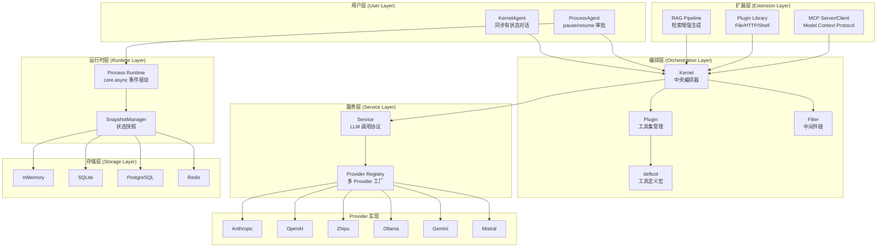
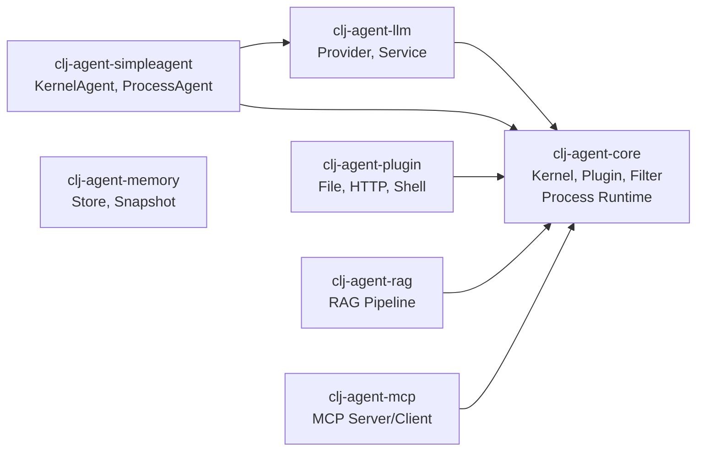

# clj-agent

Clojure AI Agent Framework - Kernel 中央编排器

[English](README_EN.md) | 中文

## 项目概述

`clj-agent` 是一个 Clojure AI Agent 框架，提供从简单对话到复杂工作流的完整解决方案：

- **Kernel + Plugin 编排**：`deftool` 宏定义工具，`defplugin` 组织工具集，Kernel 统一调度
- **多级 Invoke API**：`invoke-tool`（函数调用）、`invoke-chat`（纯 LLM）、`invoke`（工具调用循环）
- **Filter 中间件**：Ring-style 洋葱模型，支持 pre/post invocation 和 pre/post chat 四类拦截
- **Service 抽象**：LLM 服务通过 `{:chat-fn :build-result-msgs}` map 接入，无耦合
- **多 Provider 支持**：Anthropic、OpenAI、Zhipu、Ollama、Gemini、Mistral 及 OpenAI 兼容协议
- **SimpleAgent 封装**：KernelAgent（同步有状态）和 ProcessAgent（支持 pause/resume 审批）
- **Process 运行时**：基于 core.async 的事件驱动工作流，支持并行、扇入扇出、人工审批
- **多后端存储**：IKeyValueStore + ISnapshotStore 协议（Memory/SQLite/Redis/PostgreSQL）
- **RAG 支持**：检索增强生成，文档切分、向量存储、语义检索
- **MCP 协议**：Model Context Protocol 服务端和客户端实现

## 架构概览



## 模块依赖关系



> `clj-agent-memory` 是独立模块，不依赖其他内部模块。

## 模块结构

```
clj-agent/
├── modules/
│   ├── clj-agent-core/         # 核心（Kernel, Plugin, Filter, deftool, Process Runtime）
│   ├── clj-agent-llm/          # LLM Provider + Service 工厂
│   ├── clj-agent-simpleagent/  # 高级 Agent 封装（KernelAgent, ProcessAgent）
│   ├── clj-agent-plugin/       # 预置插件库（File, HTTP, Shell, Security）
│   ├── clj-agent-memory/       # 存储实现（InMemory, SQLite, Redis, PostgreSQL）
│   ├── clj-agent-rag/          # RAG 检索增强生成
│   └── clj-agent-mcp/          # MCP 服务器/客户端
├── examples/                   # 使用示例
├── docs/                       # 设计文档
├── scripts/                    # 开发脚本
└── deps.edn                    # 根依赖配置
```

## 快速开始

### 在项目中使用

```clojure
;; deps.edn
{:deps {im/ttalk-agent {:local/root "/path/to/clj-agent"}}}
```

### 方式一：SimpleAgent（推荐入门）

最简单的使用方式，自动管理对话状态：

```clojure
(require '[im.ttalk.agent.simpleagent.kernel-agent :as ka])
(require '[im.ttalk.agent.core.kernel.tool :refer [deftool]])
(require '[im.ttalk.agent.core.kernel.plugin :as kp])
(require '[im.ttalk.agent.llm.factory.builder :as factory])

;; 1. 定义工具
(deftool get-weather
  "获取天气信息"
  [[city :string "城市名称"]]
  (str city ": 晴天 25°C"))

;; 2. 创建 Plugin
(kp/defplugin my-tools "工具集" get-weather)

;; 3. 创建 Provider
(def provider (factory/create-provider-from-env :openai))

;; 4. 创建 Agent
(def agent (ka/create-agent
             {:provider provider
              :model "gpt-4"
              :system-prompt "你是一个天气助手"
              :tools [my-tools]}))

;; 5. 对话（自动累积上下文）
(println (:text (ka/chat agent "北京天气怎么样？")))
(println (:text (ka/chat agent "上海呢？")))  ;; 自动记住上下文

;; 重置对话
(ka/reset! agent)
```

### 方式二：ProcessAgent（支持敏感工具审批）

遇到标记为 `:sensitive` 的工具时自动暂停，等待人工审批：

```clojure
(require '[im.ttalk.agent.simpleagent.process-agent :as pa])

(deftool delete-file
  "删除文件"
  [[path :string "文件路径"]]
  {:sensitive true}   ;; 标记为敏感操作
  (str "已删除: " path))

(kp/defplugin file-tools "文件操作" delete-file)

(def agent (pa/create-process-agent
             {:provider provider
              :model "gpt-4"
              :tools [file-tools]
              :on-pause (fn [{:keys [reason]}]
                          (println "需要审批:" reason))}))

(let [result (pa/chat agent "删除 /tmp/test.txt")]
  (when (= :paused (:status result))
    (println "待审批工具:" (get-in result [:pending-tool :name]))
    ;; 审批通过
    (pa/resume agent "approved")
    ;; 或拒绝: (pa/resume agent "rejected")
    ))
```

### 方式三：Kernel API（完全控制）

直接使用 Kernel 获取最大灵活性：

```clojure
(require '[im.ttalk.agent.core.kernel.core :as kernel])
(require '[im.ttalk.agent.core.kernel.filter :as filters])
(require '[im.ttalk.agent.llm.kernel.chat :as chat])

;; 创建 LLM Service
(def service (chat/create-service
               {:provider provider
                :model "gpt-4"
                :max-tokens 4096}))

;; 构建 Kernel
(def app-kernel
  (-> (kernel/create-kernel-builder)
      (kernel/add-service service)
      (kernel/add-plugin my-tools)
      (kernel/add-filter filters/logging-pre-filter)
      (kernel/add-filter filters/error-handling-filter)
      (kernel/build-kernel)))

;; 工具调用循环（自动 LLM + Tool 交互）
(let [messages [{:role "user" :content "北京天气怎么样？"}]
      result (kernel/invoke app-kernel messages {})]
  (println (get-in result [:response :text]))
  (println "调用的工具:" (:tool-calls-made result)))

;; 纯 LLM 调用（不触发工具）
(let [{:keys [response]} (kernel/invoke-chat app-kernel
                           [{:role "user" :content "你好"}]
                           {})]
  (println (:text response)))

;; 单独调用工具（经过 Filter 管道）
(let [{:keys [value]} (kernel/invoke-tool app-kernel :get-weather
                        {:city "北京"} nil)]
  (println value))
```

## 核心概念

### deftool 宏

同时定义 Clojure 函数和生成 LLM tool schema：

```clojure
(deftool fn-name
  "描述（会作为 LLM 的 tool description）"
  [[param1 :string "参数描述"]
   [param2 :int "可选参数" :default 10]
   [param3 :boolean "布尔参数"]]
  {:sensitive true    ;; 可选：标记为敏感操作（ProcessAgent 会暂停审批）
   :context true}     ;; 可选：需要访问 Context（函数签名多一个 ctx 参数）
  (body ...))

;; 支持的参数类型: :string :int :float :boolean :array :object
```

### defplugin 宏

将工具组织为命名集合：

```clojure
(kp/defplugin weather-tools
  "天气相关工具"
  get-weather get-forecast)

;; 或使用函数式 API
(kp/create-plugin :weather-tools "天气工具" [#'get-weather #'get-forecast])
```

### Kernel API

Kernel 提供三类 API：

```clojure
;; Build API - 构建 Kernel
(-> (kernel/create-kernel-builder)
    (kernel/add-plugin my-plugin)       ;; 添加插件
    (kernel/add-service service)        ;; 设置 LLM 服务
    (kernel/add-filter filter-def)      ;; 添加 Filter
    (kernel/build-kernel))              ;; 构建

;; Invoke API - 调用
(kernel/invoke-tool kernel :fn-name {:arg "val"} context)  ;; 调用函数（经过 Filter）
(kernel/invoke-chat kernel messages opts)                   ;; 纯 LLM（不含工具循环）
(kernel/invoke kernel messages opts)                        ;; 工具调用循环（主入口）

;; Query API - 查询
(:tools kernel)                       ;; 所有 tool schema
(:service kernel)                     ;; 获取 service
(kernel/find-function kernel :name)   ;; 查找函数
(kernel/list-functions kernel)        ;; 列出所有函数名
```

### Service 接口

Service 是一个 map，定义 LLM 调用协议：

```clojure
{:chat-fn           (fn [messages opts] -> {:text "..." :tool-calls [...] :assistant-msg {...}})
 :build-result-msgs (fn [assistant-msg tool-results] -> [msg1 msg2 ...])}
```

`clj-agent-llm` 模块的 `chat/create-service` 可自动创建。也可自行实现此 map 接入任意 LLM。

### Filter 中间件

四种类型的 Filter，Ring-style 洋葱模型：

```clojure
;; 创建自定义 Filter
(filters/create-filter :my-filter :pre-invocation
  (fn [filter-ctx]
    (println "工具调用前:" (:tool-name filter-ctx))
    {:action :continue :context filter-ctx})
  :priority 10)

;; 内置 Filter
filters/logging-pre-filter         ;; 调用前日志
filters/logging-post-filter        ;; 调用后日志
filters/error-handling-filter      ;; 异常捕获
(filters/timeout-filter 5000)      ;; 超时控制（ms）
filters/approval-filter            ;; 敏感工具审批

;; Filter 类型
;; :pre-invocation   工具调用前（可修改 args/context，可跳过执行）
;; :post-invocation  工具调用后（可修改 result/context）
;; :pre-chat         LLM 调用前（可修改 messages/context）
;; :post-chat        LLM 调用后（可修改 response/context）
```

### Context（共享状态）

Context 管理对话中的共享状态：

```clojure
(require '[im.ttalk.agent.core.kernel.context :as ctx])

(def my-ctx (ctx/create {:user-id "u123"}))   ;; 创建（可带初始变量）
(ctx/get-var my-ctx :user-id)                  ;; 获取变量
(ctx/set-var my-ctx :key "value")              ;; 设置变量（返回新 ctx）
(ctx/get-messages my-ctx)                      ;; 获取工作消息
(ctx/get-history my-ctx)                       ;; 获取完整历史
(ctx/track-message my-ctx msg)                 ;; 追踪消息（返回新 ctx）
```

## LLM Provider

### 支持的 Provider

| Provider | 说明 | 环境变量 |
|----------|------|----------|
| `:openai` | OpenAI GPT 系列 | `OPENAI_API_KEY` |
| `:anthropic` | Anthropic Claude 系列 | `ANTHROPIC_API_KEY` |
| `:zhipu` | 智谱 GLM 系列 | `ZHIPU_API_KEY` |
| `:ollama` | 本地 Ollama 模型 | - |
| `:gemini` | Google Gemini | `GEMINI_API_KEY` |
| `:mistral` | Mistral | `MISTRAL_API_KEY` |
| `:openai-compat` | OpenAI 兼容协议 | 自定义 |

### 创建 Provider

```clojure
(require '[im.ttalk.agent.llm.factory.builder :as factory])

;; 从环境变量自动配置
(def provider (factory/create-provider-from-env :openai))

;; 手动指定配置
(def provider (factory/create-provider :anthropic
                {:api-key "sk-..."
                 :base-url "https://api.anthropic.com"}))

;; OpenAI 兼容协议（如 vLLM、LocalAI 等）
(def provider (factory/create-provider :openai-compat
                {:api-key "key"
                 :base-url "http://localhost:8000/v1"}))
```

## Process 运行时

基于 core.async 的事件驱动工作流引擎，支持：

- 线性/并行/扇入扇出执行模式
- Human-in-the-loop 暂停/恢复
- 安全快照点（on-quiescent 回调）
- Step 生命周期管理（init → can-activate? → on-activate → on-terminate）

```clojure
(require '[im.ttalk.agent.core.kernel.process.builder :as process])
(require '[im.ttalk.agent.core.kernel.process.runtime :as runtime])

;; 定义 Process
(def spec
  (-> (process/builder :document-gen)
      (process/add-step {:id :gather
                         :on-activate (fn [state ctx event]
                                        {:emit [{:target :generate
                                                 :data (:data event)}]})})
      (process/add-step {:id :generate
                         :on-activate (fn [state ctx event]
                                        {:result (generate-doc (:data event))})})
      (process/on-event :start :gather :input)
      (process/on-event :ready :generate :data)
      (process/build)))

;; 执行
(def result (runtime/run-process spec {:input {:topic "AI"}}))
```

详细设计参见 [docs/process-framework-design.md](docs/process-framework-design.md) 和 [docs/process-parallel-design.md](docs/process-parallel-design.md)。

## Memory 存储

多后端存储，用于对话历史、快照持久化：

```clojure
(require '[im.ttalk.agent.memory.api :as mem])

;; 创建存储后端
(def store (mem/create-in-memory-store))           ;; 内存（开发/测试）
(def store (mem/create-sqlite-store "agent.db"))   ;; SQLite（单机持久化）
(def store (mem/create-postgresql-store conn-opts)) ;; PostgreSQL（生产环境）
(def store (mem/create-redis-store redis-opts))    ;; Redis（分布式缓存）

;; Key-Value 操作
(mem/kv-put store "key" "namespace" {:data "value"})
(mem/kv-get store "key" "namespace")
(mem/kv-list-keys store)

;; 快照操作（Process 状态保存/恢复）
(mem/snap-put snapshot-store {:thread-id "t1"} snapshot metadata)
(mem/snap-get snapshot-store {:thread-id "t1"})
```

## RAG 检索增强生成

```clojure
(require '[im.ttalk.agent.rag.plugin :as rag])

;; 索引文档
(rag/rag-index-text "文档内容..." {:source "doc-001"})

;; 检索相关文档
(rag/rag-retrieve "搜索查询" {:top-k 5})

;; 带 RAG 的问答
(rag/rag-query "回答这个问题" {:top-k 5})
```

RAG 模块也可以作为 Kernel Plugin 注册，让 LLM 自动调用检索。

## MCP 协议

Model Context Protocol 服务端/客户端实现：

```clojure
;; 启动 MCP 服务器
;; clj -M:mcp-server

;; 客户端连接
(require '[im.ttalk.agent.mcp.client.core :as mcp-client])

(def client (mcp-client/connect {:transport :stdio
                                  :command ["clj" "-M:mcp-server"]}))
```

支持 Stdio 和 SSE 两种传输协议。

## 开发

```bash
# 运行所有测试
./scripts/test-all.sh

# 构建所有模块
./scripts/build-all.sh

# 安装到本地 Maven
./scripts/install-all.sh
```

## 依赖

核心依赖：

- org.clojure/clojure 1.11.4
- org.clojure/core.async 1.6.681
- cheshire/cheshire 5.12.0
- com.taoensso/timbre 6.3.0
- http-kit/http-kit 2.8.0
- com.github.seancorfield/next.jdbc 1.3.939
- net.clojars.wkok/openai-clojure 0.21.0

存储后端（按需引入）：

- org.xerial/sqlite-jdbc 3.45.1.0
- org.postgresql/postgresql 42.7.3
- com.taoensso/carmine 3.2.0 (Redis)

测试：

- lambdaisland/kaocha 1.85.1342

## 许可证

MIT License
