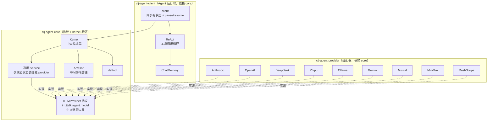
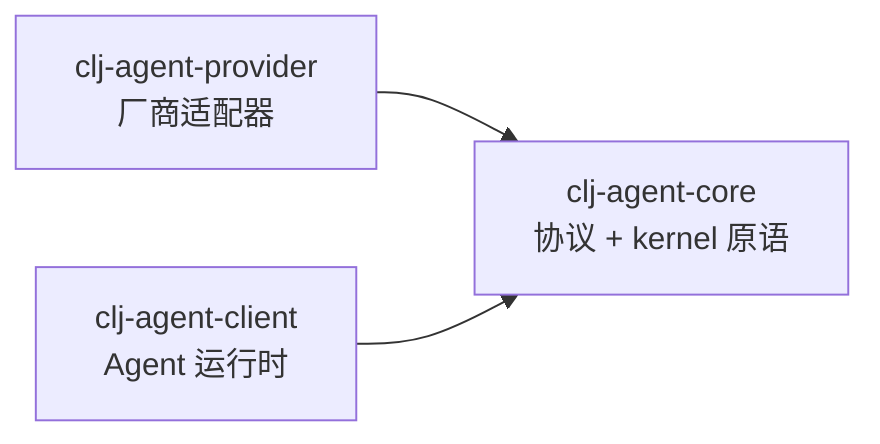

# clj-agent

Clojure AI Agent Framework - Kernel 中央编排器

[English](README_EN.md) | 中文

## 目录

- [项目概述](#项目概述)
- [架构概览](#架构概览)
- [模块结构](#模块结构)
- [快速开始](#快速开始)
  - [SimpleAgent（推荐入门）](#方式一simpleagent推荐入门)
  - [SimpleAgent + 敏感工具审批](#方式二simpleagent--敏感工具审批)
  - [Kernel API（完全控制）](#方式三kernel-api完全控制)
- [核心概念](#核心概念)
  - [deftool 宏](#deftool-宏)
  - [Kernel API](#kernel-api)
  - [Service 接口](#service-接口)
  - [Filter 中间件](#filter-中间件洋葱式-around对标-spring-ai-advisor)
  - [Context（共享状态）](#context共享状态)
- [LLM Provider](#llm-provider)
- [开发](#开发)
- [依赖](#依赖)

---

## 项目概述

`clj-agent` 是一个 Clojure AI Agent 框架，提供从简单对话到工具调用的完整解决方案：

- **Kernel + Tool 编排**：`deftool` 宏定义工具，`build-kernel` 声明式注册并统一调度
- **多级 Invoke API**：`invoke-tool`（函数调用）、`invoke-chat`（纯 LLM）；工具调用循环由 SimpleAgent 提供
- **Filter 中间件**：洋葱式 around 链（对标 Spring AI Advisor），:chat / :tool 两类，可短路/重试/计时
- **Service 抽象**：LLM 服务通过 `{:chat-fn :build-result-msgs}` map 接入，无耦合
- **多 Provider 支持**：Anthropic、OpenAI、DeepSeek、Zhipu、Ollama、Gemini、Mistral、MiniMax、DashScope（阿里云）及 OpenAI 兼容协议
- **SimpleAgent 封装**：同步有状态对话，可选 pause/resume 敏感工具审批；LLM/工具异常归一化为 `{:status :error :error <规范错误 map>}`（可配 `:on-error`）
- **统一错误模型**：失败统一用规范错误 map `{:type :message :retryable? :status :provider}`（见 `im.ttalk.agent.model.error`）。各边界封装一致：provider I/O 失败抛 `ex-info`（data 即规范错误）、配置/解析返回 `[:ok]/[:error]`、SimpleAgent 返回 `{:status :error}`、工具错误渲染成字符串喂回 LLM——彼此可单向转换，`:retryable?`/`:status` 全程不丢（如 401 始终不可重试）
- **ChatMemory**：按 conversation-id 持久化对话历史（in-memory / windowed / SQLite，SQLite store 实现 `Closeable`）

## 架构概览

采用依赖倒置(DIP)：**Core 定义协议(端口)+ kernel 原语;Client 是 Agent 运行时;Provider 实现协议——Client 与 Provider 各自依赖 Core，互不依赖**。任何实现 `im.ttalk.agent.model/ILLMProvider` 的 jar 都能注入 agent。



## 模块依赖关系



## 模块结构

```
clj-agent/
├── modules/
│   ├── clj-agent-core/      # 协议(im.ttalk.agent.model) + kernel 原语(kernel/tool/advisor)；零依赖
│   ├── clj-agent-client/    # Agent 运行时(client/react/memory/subagent)，依赖 core
│   └── clj-agent-provider/  # 厂商适配器(im.ttalk.agent.provider.*)，实现协议，依赖 core
├── examples/              # 使用示例
├── docs/                  # 设计文档
├── scripts/               # 开发脚本
└── deps.edn               # 根依赖配置
```

## 快速开始

### 在项目中使用（不发布到 Clojars）

#### 方式 A：本地路径依赖（推荐开发时使用）

在你的项目 `deps.edn` 中使用 `:local/root` 直接引用本地路径：

```clojure
;; deps.edn - 引用整个项目
{:deps {im.ttalk/clj-agent {:local/root "/path/to/clj-agent"}}}

;; 或者只引用特定模块
{:deps {im.ttalk/clj-agent-core {:local/root "/path/to/clj-agent/modules/clj-agent-core"}
        im.ttalk/clj-agent-client {:local/root "/path/to/clj-agent/modules/clj-agent-client"}
        im.ttalk/clj-agent-provider  {:local/root "/path/to/clj-agent/modules/clj-agent-provider"}}}
```

#### 方式 B：Git 依赖（推荐团队协作）

如果项目已推送到 Git 仓库（GitHub/GitLab 等）：

```clojure
;; deps.edn - 使用 commit SHA
{:deps {im.ttalk/clj-agent {:git/url "https://github.com/your-org/clj-agent"
                            :git/sha "d523507"}}}

;; 使用 tag
{:deps {im.ttalk/clj-agent {:git/url "https://github.com/your-org/clj-agent"
                            :git/tag "v0.2.0"
                            :git/sha "d523507"}}}
```

#### 方式 C：安装到本地 Maven 仓库

先打包并安装到 `~/.m2/repository`：

```bash
# 或用 ./scripts/install-all.sh 一次装全部三个模块（core → client → provider）
cd /path/to/clj-agent/modules/clj-agent-core
clj -T:build jar      # 打包
clj -T:build install  # 安装到本地 Maven 仓库
```

然后像普通 Maven 依赖一样引用：

```clojure
;; deps.edn
{:deps {im.ttalk/clj-agent-client {:mvn/version "0.2.xxx"}     ;; agent 运行时（引 core）
        im.ttalk/clj-agent-provider {:mvn/version "0.2.xxx"}}}  ;; 厂商适配器
```

> **建议**：本地开发调试用方式 A，团队共享或 CI/CD 用方式 B，需要离线使用或与 Maven 生态集成用方式 C。

### 方式一：SimpleAgent（推荐入门）

最简单的使用方式，自动管理对话状态：

```clojure
(require '[im.ttalk.agent.client :as ka])
(require '[im.ttalk.agent.tool :refer [deftool]])
(require '[im.ttalk.agent.provider.factory.builder :as factory])

;; 1. 定义工具
(deftool get-weather
  "获取天气信息"
  [[city :string "城市名称"]]
  (str city ": 晴天 25°C"))

;; 2. 创建工具集（tool var 向量）
(def my-tools [#'get-weather])

;; 3. 创建 Provider
(def provider (factory/create-provider-from-env :openai))

;; 4. 创建 Agent
(def agent (ka/create-agent
             {:provider provider
              :model "gpt-4"
              :system-prompt "你是一个天气助手"
              :tools my-tools}))

;; 5. 对话（自动累积上下文）
;; chat 返回 {:status :completed|:paused|:error ...}：
;;   :completed -> {:text "..." :tool-calls-made [...]}
;;   :paused    -> 见方式二（敏感工具审批）
;;   :error     -> {:error {:type :network-error|:provider-error ... :retryable? bool}}（不抛裸异常）
(println (:text (ka/chat agent "北京天气怎么样？")))
(println (:text (ka/chat agent "上海呢？")))  ;; 自动记住上下文

;; 重置对话
(ka/reset! agent)
```

### 方式二：SimpleAgent + 敏感工具审批

SimpleAgent 配置 `:on-pause` 即启用 pause/resume：遇到标记为 `:sensitive` 的工具时自动暂停，等待人工审批：

```clojure
(require '[im.ttalk.agent.client :as ka])

(deftool delete-file
  "删除文件"
  [[path :string "文件路径"]]
  {:sensitive true}   ;; 标记为敏感操作
  (str "已删除: " path))

(def file-tools [#'delete-file])

(def agent (ka/create-agent
             {:provider provider
              :model "gpt-4"
              :tools file-tools
              :on-pause (fn [{:keys [reason]}]
                          (println "需要审批:" reason))}))   ;; 配置即启用 pause/resume

(let [result (ka/chat agent "删除 /tmp/test.txt")]
  (when (= :paused (:status result))
    (println "待审批工具:" (get-in result [:pending-tool :name]))
    (ka/resume agent "approved")                                ;; 批准
    ;; (ka/resume agent "rejected")                             ;; 拒绝
    ;; (ka/resume agent "rejected" {:message "先退款再删"})     ;; 拒绝带理由（模型直接拿到）
    ;; (ka/resume agent "approved" {:args {:path "/tmp/b"}})    ;; 编辑参数后批准
    ;; (ka/resume agent "reply" {:message "选 B 方案"})         ;; 答复即工具结果（ask-user）
    ))
```

**ask-user 模式**：定义一个 body 永不执行的提问工具，`:on-tool-call` 拦截暂停，
用户答案经 `(ka/resume agent "reply" {:message 答案})` 直接作为工具结果回模型
——模型侧看到的就是一次普通的工具往返。

**跨进程重启的 HITL**：配置 `:pause-store`（配合 SQLite ChatMemory），暂停快照自动持久化；
重启后用同一 conversation-id + 同一 store 重建 agent，`paused?`/`resume` 透明恢复
（累积的 context 状态槽一并恢复）：

```clojure
(require '[im.ttalk.agent.pause :as pause]
         '[im.ttalk.agent.memory.sqlite :as sqlite])

(def agent (ka/create-agent {:provider provider :tools file-tools
                             :memory (sqlite/sqlite-store "agent.db")
                             :pause-store (pause/sqlite-pause-store "agent.db")
                             :conversation-id "order-42"
                             :callbacks {:on-tool-call ...}}))
;; 暂停 → 进程退出 → 重启后同配置重建 → (ka/resume agent "approved")
```

环境类工具失败（如凭证失效，`{:error-class :environment}`）的暂停同样支持：
`(ka/resume agent "retry")` 表示环境已修复、重跑失败工具。

**Timeline 与多分支**：对话日志即时间线，分支 = 前缀复制到新 conversation-id：

```clojure
(require '[im.ttalk.agent.timeline :as tl])

(def deps {:memory mem :pause-store ps :lineage (tl/in-memory-lineage-store)})
(tl/fork! deps "main" {:as "exp"})       ;; 全量分支（源暂停中则连带暂停快照——
                                          ;;   两支可各自 resume 不同审批决策做对比）
(tl/fork! deps "main" {:at 4})           ;; 在第 4 条消息处开分支（编辑重试：
                                          ;;   fork 前缀 + 在分支上重发改写后的消息）
(tl/rollback! deps "main" 4)             ;; 破坏性截断（"重新生成"）
(tl/ancestry deps "exp")                 ;; 血缘回溯
(tl/prune! deps "exp")                   ;; 删分支（有子分支拒绝）
```

合法 fork/rollback 点是 **turn 边界或暂停点**。工具的 `:writes` 会作为元数据
随 tool-result 消息进历史（审计 + event-sourcing 伏笔），不会发给 LLM。

### 方式三：Kernel API（完全控制）

直接使用 Kernel 获取最大灵活性：

```clojure
(require '[im.ttalk.agent.kernel :as kernel])
(require '[im.ttalk.agent.advisor :as filters])
(require '[im.ttalk.agent.model.service :as service])

;; 创建 LLM Service（通用：仅凭协议包装任意 provider）
(def service (service/create-service
               provider
               {:model "gpt-4"
                :max-tokens 4096}))

;; 构建 Kernel（声明式；kernel 只提供原语：invoke-chat / invoke-tool）
(def app-kernel
  (kernel/build-kernel
    {:service service
     :tools   my-tools                    ;; tool var 向量
     :filters [filters/logging-filter]}))

;; 纯 LLM 调用（经 :chat filter 链，不触发工具）
(let [{:keys [response]} (kernel/invoke-chat app-kernel
                           [{:role "user" :content "你好"}]
                           {})]
  (println (:text response)))

;; 单独调用工具（经 :tool filter 链）
(let [{:keys [value]} (kernel/invoke-tool app-kernel :get-weather
                        {:city "北京"} nil)]
  (println value))

;; 完整的「工具调用循环」是 SimpleAgent 的职责（见上文方式一），不在 kernel：
;; (require '[im.ttalk.agent.client :as agent])
;; (agent/chat (agent/create-agent {:provider provider :tools my-tools}) "北京天气怎么样？")
```

## 核心概念

### deftool 宏

同时定义 Clojure 函数和生成 LLM tool schema：

```clojure
(deftool fn-name
  "描述（会作为 LLM 的 tool description）"
  [[param1 :string "参数描述"]
   [param2 :int "可选参数" :default 10]
   [param3 :boolean "布尔参数"]]
  {:sensitive true    ;; 可选：标记为敏感操作（SimpleAgent 配置 :on-pause 时会暂停审批）
   :context true      ;; 可选：读取 Context（函数签名多一个只读 ctx 参数）
   :serial true       ;; 可选：副作用工具——同批含 serial 工具时整批退化为按序执行
   :retry true}       ;; 可选：幂等工具 opt-in——:transient 类失败自动指数退避重试
                      ;;（或 {:max-retries 2 :initial-delay-ms 200}）
  (body ...))

;; 支持的参数类型: :string :int :float :boolean :array :object

;; 写共享状态：任意工具返回 {:result r :writes {k v}} 声明写意图（ctx 本身只读）；
;; 同一轮的多个 tool-call 并行执行，屏障处按原始序经 :state-slots 的 reducer 折叠：
(kernel/build-kernel {:tools [...] :state-slots {:notes {:init [] :reduce conj}}})
;; 未声明的槽默认 last-writer；失败/超时/被拒的调用 writes 不生效（单工具事务性）

;; 失败分层路由（缺省一切错误序列化为结果交给模型——errors are data）：
(throw (ex-info "网络抖动" {:error-class :transient}))    ;; 声明 :retry 的工具自动重试
(throw (ex-info "凭证失效" {:error-class :environment}))  ;; :on-env-error :pause 时屏障处暂停等人
;; 工具内调 provider 的 canonical error（:retryable?/:auth-error）自动获得正确分类
```

### Kernel API

Kernel 提供三类 API：

```clojure
;; Build API - 声明式构建 Kernel
(kernel/build-kernel
  {:service  service                    ;; LLM 服务
   :tools    my-tools                   ;; tool var 向量
   :filters  [filter-def]               ;; Filter 列表
   :settings {:max-tool-iterations 10}})

;; Invoke API - 调用（两个原语，均经 filter 洋葱链）
(kernel/invoke-tool kernel :fn-name {:arg "val"} context)  ;; 调用函数（:tool 链）
(kernel/invoke-chat kernel messages opts)                   ;; 纯 LLM（:chat 链，不含工具循环）
;; 工具调用循环不在 kernel —— 见 im.ttalk.agent.client（create-agent + chat）

;; Query API - 查询
(:tools kernel)                       ;; 所有 tool schema
(:service kernel)                     ;; 获取 service
(kernel/find-function kernel :name)   ;; 查找函数
(kernel/list-functions kernel)        ;; 列出所有函数名
```

### Service 接口

Service 是一个 map，定义 LLM 调用协议：

```clojure
{:chat-fn           (fn [messages opts] -> {:text "..." :tool-calls [...] :assistant-msg {...}})
 :build-result-msgs (fn [assistant-msg tool-results] -> [msg1 msg2 ...])}
```

core 的 `im.ttalk.agent.model.service/create-service`（通用，仅凭协议）可从任意 provider 创建。也可自行实现此 map 接入任意 LLM。

### Filter 中间件（洋葱式 around，对标 Spring AI Advisor）

根抽象是 `around(req, chain)`：chain 是下游，由 filter 决定调不调、调几次、前后干什么
（可短路 / 重试 / 计时）。一个 filter 通过 `:chat` / `:tool` / `:turn` 三个键挂到对应链上，
可任意并存。**执行顺序即 `:filters` 向量中的注册顺序**（无 `:order`/`:phase`）；
靠前的 filter 在最外层（最先看到 req、最后看到 resp）。

三条链的粒度：`:chat` 包**单次 LLM 调用**（工具循环内每轮执行，memory 在此）；
`:tool` 包**单次工具执行**（并行任务内各自生效）；`:turn` 包**整个工具循环**
（每 turn 一次——RAG 注入、最终答案校验/guardrail、turn 级预算的正确位置；
闭包链天然"仅下游"，turn filter 可多次 `(chain req)` 递归重入实现校验重试，
但 `:paused`/`:cancelled`/`:error` 结果必须透传）。

```clojure
;; 自定义 filter —— create-filter 接受 name 后跟 :chat / :tool 关键字参数
(def my-filter
  (filters/create-filter :my-filter
    :tool (fn [req chain]                      ;; around-tool
            (println "工具调用前:" (get-in req [:function :name]))
            (chain req))))                     ;; 不调 chain 即短路

;; 同一 filter 可同时挂 chat 与 tool
(def both
  (filters/create-filter :both
    :chat (fn [req chain] (chain (update req :messages conj sys-msg)))
    :tool (fn [req chain] (chain req))))

;; 也可直接写 map：{:name :x :chat (fn [req chain] ...) :tool (fn [req chain] ...)}

;; 内置 filter
filters/logging-filter        ;; 调用前后日志（:tool）
(filters/timeout-filter 5000) ;; 超时控制（ms，around；超时标 :transient 可触发重试）
(filters/approval-filter)     ;; 敏感工具审批（拒绝则短路）
(filters/validation-turn-filter validate-fn :max-retries 2)
                              ;; 最终答案校验（:turn）：不合格带反馈重入循环重试

;; 注册：filters 向量顺序即洋葱层序（越靠前越外层）
(kernel/build-kernel {:service svc :tools tools :filters [my-filter both]})
;; 链类型：:chat（invoke-chat，terminal 调 LLM）| :tool（invoke-tool，terminal 调函数）
;; tool 链契约：请求 {:function :args :context(只读)}，响应 {:result (:writes)}——
;; filter 可改写 :args、短路、around；无需（也不应）回传 :context。
;; 注意：同一轮的多个 tool-call 并行执行，交互式审批请放 agent 的 :tool-gate（批前串行），
;; 勿放 tool filter（会在并行任务中并发弹提示）。
```

### Context（请求级共享状态）

Context 是扁平 map；对工具与 filter 而言是**只读环境**（conversation-id、用户信息等），
工具的写意图经返回值 `:writes` 声明、在每轮工具批次的屏障处统一折叠
（并行安全、按调用序确定，见 `docs/agent-loop-concurrency-design.md`）：

```clojure
(require '[im.ttalk.agent.context :as ctx])

(def my-ctx (ctx/create {:user-id "u123"}))    ;; 创建（可带初始变量）
(ctx/context? my-ctx)                          ;; 谓词
(ctx/get-var my-ctx :user-id)                  ;; 获取变量
(ctx/set-var my-ctx :key "value")              ;; 设置单个变量（返回新 ctx，调用方侧使用）
(ctx/conversation-id my-ctx)                   ;; 取会话 id
(ctx/with-conversation-id my-ctx "u1")         ;; 设会话 id（返回新 ctx）
(ctx/apply-writes my-ctx [{:k 1}] slots)       ;; 批次写折叠（框架在屏障处调用）
```

> 对话历史不在 Context 里，而是由 ChatMemory store 按 conversation-id 维护（见 `im.ttalk.agent.memory` / Memory Filter）。

## LLM Provider

### 支持的 Provider

| Provider | 说明 | 环境变量 | 推荐模型 |
|----------|------|----------|----------|
| `:openai` | OpenAI GPT 系列 | `OPENAI_API_KEY` | gpt-4o, gpt-4.1, o3 |
| `:anthropic` | Anthropic Claude 系列 | `ANTHROPIC_API_KEY` | claude-opus-4, claude-sonnet-4 |
| `:zhipu` | 智谱 GLM 系列 | `ZHIPU_API_KEY` | glm-4.7, glm-4.6 |
| `:ollama` | 本地 Ollama 模型 | - | llama3, mistral, qwen |
| `:gemini` | Google Gemini（OpenAI 兼容端点） | `GOOGLE_API_KEY` | gemini-2.0-flash, gemini-1.5-pro |
| `:mistral` | Mistral | `MISTRAL_API_KEY` | mistral-large-latest |
| `:deepseek` | DeepSeek | `DEEPSEEK_API_KEY` | deepseek-chat, deepseek-reasoner |
| `:minimax` | MiniMax（Anthropic 兼容端点） | `MINIMAX_API_KEY` | MiniMax-M2 |
| `:dashscope` | 阿里云 DashScope（原生 SSE 流式） | `DASHSCOPE_API_KEY` | qwen-plus, qwen-max |
| `:openai-compat` | OpenAI 兼容协议 | 自定义 | 取决于后端 |

> **各家进阶能力**（结构化输出、并行工具调用、`reasoning_effort`、Anthropic prompt
> caching / web_search / citations / skills、DeepSeek 推理与前缀续写等）详见
> [`clj-agent-provider` README](modules/clj-agent-provider/README.md)。
>
> **关于流式**：真增量 SSE 传输基于 JDK `java.net.http`（见 `design/streaming-async-design.md`），
> 已接入主链路——`client/chat-stream` 在 ReAct 循环里逐 token 流出、`on-complete` 落库，
> 与同步对话历史不分叉，并支持取消令牌（断连即停）。**所有内置 provider 均支持流式**
> （含 DashScope 原生 SSE：`X-DashScope-SSE` + `incremental_output`）；个别 provider 若不支持，
> service 会自动回退同步并把全文作为单个 token emit。
> Web 框架（http-kit / Undertow / Jetty / Aleph）的 WebSocket/SSE 集成示例见 `examples/streaming/`。

### 创建 Provider

```clojure
(require '[im.ttalk.agent.provider.factory.builder :as factory])

;; 方式 1: 从环境变量自动配置（推荐）
(def provider (factory/create-provider-from-env :openai))

;; 方式 2: 手动指定配置
(def provider (factory/create-provider :anthropic
                {:api-key "sk-..."
                 :base-url "https://api.anthropic.com"}))

;; 方式 3: OpenAI 兼容协议（vLLM、LocalAI、LM Studio 等）
(def provider (factory/create-provider :openai-compat
                {:api-key "key"
                 :base-url "http://localhost:8000/v1"}))

;; 方式 4: 智谱 GLM（国产大模型）
(require '[im.ttalk.agent.provider.zhipu :as zhipu])
(def provider (zhipu/create-provider
                {:api-key (System/getenv "ZHIPU_API_KEY")
                 :base-url "https://open.bigmodel.cn/api/paas/v4"}))

;; 方式 5: 本地 Ollama
(require '[im.ttalk.agent.provider.ollama :as ollama])
(def provider (ollama/create-provider
                {:base-url "http://localhost:11434"}))
```

### 直接调用 Provider

```clojure
(require '[im.ttalk.agent.model :as proto])

;; 简单对话
(proto/call-simple provider
  {:model "gpt-4" :max-tokens 1024}
  [{:role "user" :content "你好"}])
;; => "你好！有什么我可以帮助你的吗？"

;; 带工具的调用
(proto/call-with-tools provider
  {:model "gpt-4" :max-tokens 1024}
  [{:role "user" :content "北京天气怎么样？"}]
  [{:name "get-weather" :description "获取天气" :parameters {...}}])
;; => {:text "..." :tool-calls [{:id "..." :name "get-weather" :args {:city "北京"}}]}
```

## 高级用法：完整示例

### 多 Agent 协作

```clojure
;; 创建专业化 Agent
(def researcher (ka/create-agent
                  {:provider provider
                   :model "gpt-4"
                   :tools [web-search-plugin]
                   :system-prompt "你是研究员，负责查找和整理信息。"}))

(def writer (ka/create-agent
              {:provider provider
               :model "gpt-4"
               :tools []
               :system-prompt "你是写作专家，负责将信息整理成文章。"}))

;; 协作流程
(defn research-and-write [topic]
  (let [;; 研究员收集信息
        research-result (ka/chat researcher (str "研究主题: " topic))
        facts (:text research-result)
        ;; 将研究结果传给写作者
        article (ka/chat writer (str "基于以下信息写一篇文章:\n" facts))]
    (:text article)))
```

## 开发

```bash
# 运行所有测试
./scripts/test-all.sh

# 构建所有模块
./scripts/build-all.sh

# 安装到本地 Maven
./scripts/install-all.sh

# 单独跑某个模块
cd modules/clj-agent-core && clojure -M:test
```

> CI：`.github/workflows/test.yml` 在 push / PR 到 `main` 时对三个模块并行跑测试。

## 依赖

核心依赖：

- org.clojure/clojure 1.11.4
- cheshire/cheshire 5.12.0（provider，JSON）
- com.taoensso/timbre 6.3.0（client / provider，日志）

> core 模块零外部依赖；HTTP 客户端走 JDK 内置 java.net.http，无额外依赖。

持久化 ChatMemory（client 模块，SQLite 后端，按需引入 `im.ttalk.agent.memory.sqlite`）：

- com.github.seancorfield/next.jdbc 1.3.939
- org.xerial/sqlite-jdbc 3.45.1.0

测试：

- lambdaisland/kaocha 1.85.1342

## 许可证

MIT License
