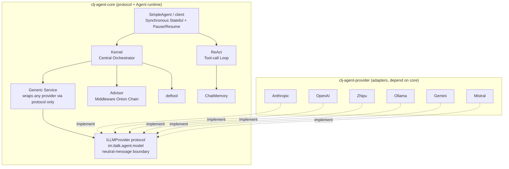
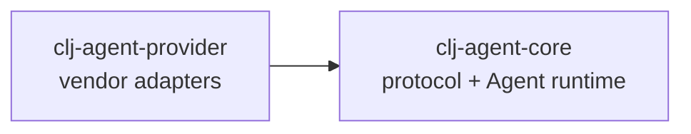

# clj-agent

Clojure AI Agent Framework - Kernel Central Orchestrator

English | [中文](README.md)

## Overview

`clj-agent` is a Clojure AI Agent framework providing a complete solution from simple conversations to tool-calling agents:

- **Kernel + Tool Orchestration**: `deftool` macro for tool definitions, `build-kernel` declaratively registers and schedules them
- **Multi-level Invoke API**: `invoke-tool` (function call), `invoke-chat` (pure LLM); the tool-calling loop is provided by SimpleAgent
- **Filter Middleware**: onion-style around chain (mirrors Spring AI Advisor), :chat / :tool phases, can short-circuit/retry/time
- **Service Abstraction**: LLM services via `{:chat-fn :build-result-msgs}` map, zero coupling
- **Multi-Provider Support**: Anthropic, OpenAI, DeepSeek, Zhipu, Ollama, Gemini, Mistral, MiniMax, Bailian, and OpenAI-compatible protocols
- **SimpleAgent Wrapper**: synchronous stateful conversation with optional pause/resume sensitive-tool approval; LLM/tool errors normalized to `{:status :error}` (configurable `:on-error`)
- **ChatMemory**: per-conversation-id history persistence (in-memory / windowed / SQLite; the SQLite store is `Closeable`)

## Architecture Overview

Dependency Inversion: **Core defines the protocol (port) + Agent runtime; Provider implements the protocol and depends on Core.** Any jar implementing `im.ttalk.agent.model/ILLMProvider` can be injected as a provider.



## Module Dependencies



## Module Structure

```
clj-agent/
├── modules/
│   ├── clj-agent-core/      # Protocol (im.ttalk.agent.model) + Agent runtime; no internal deps
│   └── clj-agent-provider/  # Vendor adapters (im.ttalk.agent.provider.*), implement protocol, depend on core
├── examples/              # Usage Examples
├── docs/                  # Design Documents
├── scripts/               # Development Scripts
└── deps.edn               # Root Dependency Configuration
```

## Quick Start

### Add to Your Project

```clojure
;; deps.edn
{:deps {im/ttalk-agent {:local/root "/path/to/clj-agent"}}}
```

### Option 1: SimpleAgent (Recommended for Getting Started)

The simplest way to use the framework with automatic state management:

```clojure
(require '[im.ttalk.agent.client :as ka])
(require '[im.ttalk.agent.tool :refer [deftool]])
(require '[im.ttalk.agent.provider.factory.builder :as factory])

;; 1. Define tools
(deftool get-weather
  "Get weather information for a city"
  [[city :string "City name"]]
  (str city ": Sunny 25°C"))

;; 2. Create tools collection (tool var vector)
(def my-tools [#'get-weather])

;; 3. Create Provider
(def provider (factory/create-provider-from-env :openai))

;; 4. Create Agent
(def agent (ka/create-agent
             {:provider provider
              :model "gpt-4"
              :system-prompt "You are a weather assistant"
              :tools my-tools}))

;; 5. Chat (auto-accumulates context)
(println (:text (ka/chat agent "What's the weather in Beijing?")))
(println (:text (ka/chat agent "How about Shanghai?")))  ;; remembers context

;; Reset conversation
(ka/reset! agent)
```

### Option 2: SimpleAgent + Sensitive Tool Approval

Configuring `:on-pause` enables pause/resume: the agent automatically pauses when encountering tools marked as `:sensitive`, awaiting human approval:

```clojure
(require '[im.ttalk.agent.client :as ka])

(deftool delete-file
  "Delete a file"
  [[path :string "File path"]]
  {:sensitive true}   ;; Mark as sensitive operation
  (str "Deleted: " path))

(def file-tools [#'delete-file])

(def agent (ka/create-agent
             {:provider provider
              :model "gpt-4"
              :tools file-tools
              :on-pause (fn [{:keys [reason]}]
                          (println "Approval needed:" reason))}))   ;; enables pause/resume

(let [result (ka/chat agent "Delete /tmp/test.txt")]
  (when (= :paused (:status result))
    (println "Pending tool:" (get-in result [:pending-tool :name]))
    ;; Approve
    (ka/resume agent "approved")
    ;; Or reject: (ka/resume agent "rejected")
    ))
```

### Option 3: Kernel API (Full Control)

Use the Kernel directly for maximum flexibility:

```clojure
(require '[im.ttalk.agent.kernel :as kernel])
(require '[im.ttalk.agent.advisor :as filters])
(require '[im.ttalk.agent.model.service :as service])

;; Create LLM Service (generic: wraps any provider via protocol only)
(def service (service/create-service
               provider
               {:model "gpt-4"
                :max-tokens 4096}))

;; Build Kernel (declarative; kernel provides only the primitives: invoke-chat / invoke-tool)
(def app-kernel
  (kernel/build-kernel
    {:service service
     :tools   my-tools                    ;; vector of tool vars
     :filters [filters/logging-filter]}))

;; Pure LLM call (:chat filter chain, no tool invocation)
(let [{:keys [response]} (kernel/invoke-chat app-kernel
                           [{:role "user" :content "Hello"}]
                           {})]
  (println (:text response)))

;; Direct tool invocation (:tool filter chain)
(let [{:keys [value]} (kernel/invoke-tool app-kernel :get-weather
                        {:city "Beijing"} nil)]
  (println value))

;; The full tool-calling loop is SimpleAgent's job (see Option 1 above), not the kernel:
;; (require '[im.ttalk.agent.client :as agent])
;; (agent/chat (agent/create-agent {:provider provider :tools my-tools}) "What's the weather in Beijing?")
```

## Core Concepts

### deftool Macro

Simultaneously defines a Clojure function and generates an LLM tool schema:

```clojure
(deftool fn-name
  "Description (becomes the LLM tool description)"
  [[param1 :string "Parameter description"]
   [param2 :int "Optional parameter" :default 10]
   [param3 :boolean "Boolean parameter"]]
  {:sensitive true    ;; Optional: mark as sensitive (SimpleAgent pauses for approval when :on-pause is set)
   :context true}     ;; Optional: needs Context access (adds ctx parameter to function signature)
  (body ...))

;; Supported parameter types: :string :int :float :boolean :array :object
```

### Kernel API

Kernel provides three categories of APIs:

```clojure
;; Build API - declarative Kernel construction
(kernel/build-kernel
  {:service  service                    ;; LLM service
   :tools    my-tools                   ;; vector of tool vars
   :filters  [filter-def]               ;; filter list
   :settings {:max-tool-iterations 10}})

;; Invoke API - two primitives (both through the filter onion chain)
(kernel/invoke-tool kernel :fn-name {:arg "val"} context)  ;; Function call (:tool chain)
(kernel/invoke-chat kernel messages opts)                   ;; Pure LLM (:chat chain, no tool loop)
;; The tool-calling loop is NOT in the kernel — see im.ttalk.agent.client (create-agent + chat)

;; Query API - Query
(:tools kernel)                       ;; All tool schemas
(:service kernel)                     ;; Get service
(kernel/find-function kernel :name)   ;; Find function
(kernel/list-functions kernel)        ;; List all function names
```

### Service Interface

Service is a map defining the LLM call protocol:

```clojure
{:chat-fn           (fn [messages opts] -> {:text "..." :tool-calls [...] :assistant-msg {...}})
 :build-result-msgs (fn [assistant-msg tool-results] -> [msg1 msg2 ...])}
```

Core's generic `im.ttalk.agent.model.service/create-service` (protocol-only) builds this from any provider. You can also implement this map yourself to integrate any LLM.

### Filter Middleware (onion-style around, mirrors Spring AI Advisor)

The root abstraction is `around(req, chain)`: the filter holds the downstream `chain`
and decides whether/when/how many times to call it (short-circuit / retry / time it).
`before`/`after` are sugar for request/response rewriting only.

```clojure
;; Custom filter — around (gets the chain)
(filters/create-filter :my-filter :tool :order 10
  :around (fn [req chain]
                 (println "Before tool call:" (get-in req [:function :name]))
                 (chain req)))        ;; not calling chain => short-circuit

;; Or rewrite-only (sugar)
(filters/create-filter :inject :chat :order 0
  :before (fn [req] (update req :messages conj sys-msg)))

;; Built-in tool filters
filters/logging-filter        ;; Pre/post-call logging
(filters/timeout-filter 5000) ;; Timeout control (ms, around)
(filters/approval-filter)     ;; Sensitive tool approval (short-circuits on reject)

;; phase: :chat (invoke-chat, terminal calls LLM) | :tool (invoke-tool, terminal calls fn)
;; order: smaller = outer (before runs first, after runs last)
```

### Context (Shared State)

Context manages shared state within a conversation:

```clojure
(require '[im.ttalk.agent.context :as ctx])

(def my-ctx (ctx/create {:user-id "u123"}))    ;; Create (with initial variables)
(ctx/context? my-ctx)                          ;; Predicate
(ctx/get-var my-ctx :user-id)                  ;; Get variable
(ctx/set-var my-ctx :key "value")              ;; Set one variable (returns new ctx)
(ctx/set-vars my-ctx {:a 1 :b 2})              ;; Set multiple (returns new ctx)
(ctx/conversation-id my-ctx)                   ;; Get conversation id
(ctx/with-conversation-id my-ctx "u1")         ;; Set conversation id (returns new ctx)
```

> Conversation history is NOT in Context; it is maintained by a ChatMemory store keyed by conversation-id (see `im.ttalk.agent.memory` / Memory Filter).

## LLM Providers

### Supported Providers

| Provider | Description | Environment Variable |
|----------|-------------|---------------------|
| `:openai` | OpenAI GPT series | `OPENAI_API_KEY` |
| `:anthropic` | Anthropic Claude series | `ANTHROPIC_API_KEY` |
| `:zhipu` | Zhipu GLM series | `ZHIPU_API_KEY` |
| `:ollama` | Local Ollama models | - |
| `:gemini` | Google Gemini (OpenAI-compatible endpoint) | `GOOGLE_API_KEY` |
| `:mistral` | Mistral | `MISTRAL_API_KEY` |
| `:deepseek` | DeepSeek | `DEEPSEEK_API_KEY` |
| `:minimax` | MiniMax (Anthropic-compatible endpoint) | `MINIMAX_API_KEY` |
| `:bailian` | Alibaba Bailian / DashScope (sync only) | `BAILIAN_API_KEY` / `DASHSCOPE_API_KEY` |
| `:openai-compat` | OpenAI-compatible protocol | Custom |

> Advanced per-provider capabilities (structured output, parallel tool calls,
> `reasoning_effort`, Anthropic prompt caching / web_search / citations / skills,
> DeepSeek reasoning & prefix completion, etc.) are documented in the
> [`clj-agent-provider` README](modules/clj-agent-provider/README.md). All providers
> support both **sync** and **streaming (SSE)** (Bailian is sync-only).

### Creating Providers

```clojure
(require '[im.ttalk.agent.provider.factory.builder :as factory])

;; Auto-configure from environment variables
(def provider (factory/create-provider-from-env :openai))

;; Manual configuration
(def provider (factory/create-provider :anthropic
                {:api-key "sk-..."
                 :base-url "https://api.anthropic.com"}))

;; OpenAI-compatible protocol (e.g., vLLM, LocalAI)
(def provider (factory/create-provider :openai-compat
                {:api-key "key"
                 :base-url "http://localhost:8000/v1"}))
```

## Development

```bash
# Run all tests
./scripts/test-all.sh

# Build all modules
./scripts/build-all.sh

# Install to local Maven
./scripts/install-all.sh
```

## Dependencies

Core:

- org.clojure/clojure 1.11.4
- cheshire/cheshire 5.12.0
- com.taoensso/timbre 6.3.0
- http-kit/http-kit 2.8.0
- net.clojars.wkok/openai-clojure 0.21.0

Persistent ChatMemory (SQLite backend, opt-in via `im.ttalk.agent.memory.sqlite`):

- com.github.seancorfield/next.jdbc 1.3.939
- org.xerial/sqlite-jdbc 3.45.1.0

Testing:

- lambdaisland/kaocha 1.85.1342

## License

MIT License
