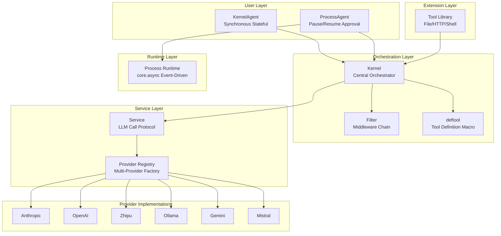
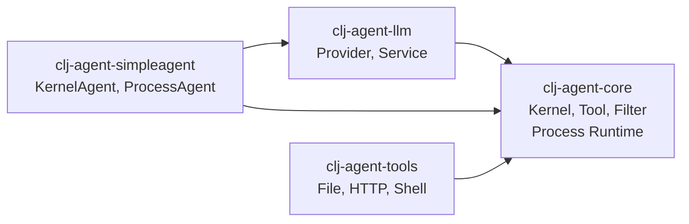

# clj-agent

Clojure AI Agent Framework - Kernel Central Orchestrator

English | [中文](README.md)

## Overview

`clj-agent` is a Clojure AI Agent framework providing a complete solution from simple conversations to complex workflows:

- **Kernel + Tool Orchestration**: `deftool` macro for tool definitions, Kernel uses `add-tools` for unified scheduling
- **Multi-level Invoke API**: `invoke-tool` (function call), `invoke-chat` (pure LLM), `invoke` (tool-calling loop)
- **Filter Middleware**: Ring-style onion model with 4 filter types (pre/post invocation, pre/post chat)
- **Service Abstraction**: LLM services via `{:chat-fn :build-result-msgs}` map, zero coupling
- **Multi-Provider Support**: Anthropic, OpenAI, Zhipu, Ollama, Gemini, Mistral, and OpenAI-compatible protocols
- **SimpleAgent Wrappers**: KernelAgent (synchronous stateful) and ProcessAgent (pause/resume approval)
- **Process Runtime**: core.async-based event-driven workflows with parallel, fan-in/fan-out, human-in-the-loop

## Architecture Overview



## Module Dependencies



## Module Structure

```
clj-agent/
├── modules/
│   ├── clj-agent-core/         # Core (Kernel, Tool, Filter, deftool, Process Runtime)
│   ├── clj-agent-llm/          # LLM Provider + Service Factory
│   ├── clj-agent-simpleagent/  # High-level Agent Wrappers (KernelAgent, ProcessAgent)
│   └── clj-agent-tools/       # Pre-built Plugin Library (File, HTTP, Shell, Security)
├── examples/                   # Usage Examples
├── docs/                       # Design Documents
├── scripts/                    # Development Scripts
└── deps.edn                    # Root Dependency Configuration
```

## Quick Start

### Add to Your Project

```clojure
;; deps.edn
{:deps {im/ttalk-agent {:local/root "/path/to/clj-agent"}}}
```

### Option 1: SimpleAgent (Recommended for Getting Started)

The simplest way to use the framework with automatic state management:

```clojure
(require '[im.ttalk.agent.simpleagent.kernel-agent :as ka])
(require '[im.ttalk.agent.core.kernel.tool :refer [deftool]])
(require '[im.ttalk.agent.llm.factory.builder :as factory])

;; 1. Define tools
(deftool get-weather
  "Get weather information for a city"
  [[city :string "City name"]]
  (str city ": Sunny 25°C"))

;; 2. Create tools collection (tool var vector)
(def my-tools [#'get-weather])

;; 3. Create Provider
(def provider (factory/create-provider-from-env :openai))

;; 4. Create Agent
(def agent (ka/create-agent
             {:provider provider
              :model "gpt-4"
              :system-prompt "You are a weather assistant"
              :tools my-tools}))

;; 5. Chat (auto-accumulates context)
(println (:text (ka/chat agent "What's the weather in Beijing?")))
(println (:text (ka/chat agent "How about Shanghai?")))  ;; remembers context

;; Reset conversation
(ka/reset! agent)
```

### Option 2: ProcessAgent (Sensitive Tool Approval)

Automatically pauses when encountering tools marked as `:sensitive`, awaiting human approval:

```clojure
(require '[im.ttalk.agent.simpleagent.process-agent :as pa])

(deftool delete-file
  "Delete a file"
  [[path :string "File path"]]
  {:sensitive true}   ;; Mark as sensitive operation
  (str "Deleted: " path))

(def file-tools [#'delete-file])

(def agent (pa/create-process-agent
             {:provider provider
              :model "gpt-4"
              :tools file-tools
              :on-pause (fn [{:keys [reason]}]
                          (println "Approval needed:" reason))}))

(let [result (pa/chat agent "Delete /tmp/test.txt")]
  (when (= :paused (:status result))
    (println "Pending tool:" (get-in result [:pending-tool :name]))
    ;; Approve
    (pa/resume agent "approved")
    ;; Or reject: (pa/resume agent "rejected")
    ))
```

### Option 3: Kernel API (Full Control)

Use the Kernel directly for maximum flexibility:

```clojure
(require '[im.ttalk.agent.core.kernel :as kernel])
(require '[im.ttalk.agent.core.kernel.filter :as filters])
(require '[im.ttalk.agent.llm.kernel.chat :as chat])

;; Create LLM Service
(def service (chat/create-service
               {:provider provider
                :model "gpt-4"
                :max-tokens 4096}))

;; Build Kernel
(def app-kernel
  (-> (kernel/create-kernel-builder)
      (kernel/add-service service)
      (kernel/add-tools my-tools)
      (kernel/add-filter filters/logging-pre-filter)
      (kernel/add-filter filters/error-handling-filter)
      (kernel/build-kernel)))

;; Tool-calling loop (auto LLM + Tool interaction)
(let [messages [{:role "user" :content "What's the weather in Beijing?"}]
      result (kernel/invoke app-kernel messages {})]
  (println (get-in result [:response :text]))
  (println "Tools called:" (:tool-calls-made result)))

;; Pure LLM call (no tool invocation)
(let [{:keys [response]} (kernel/invoke-chat app-kernel
                           [{:role "user" :content "Hello"}]
                           {})]
  (println (:text response)))

;; Direct tool invocation (through Filter pipeline)
(let [{:keys [value]} (kernel/invoke-tool app-kernel :get-weather
                        {:city "Beijing"} nil)]
  (println value))
```

## Core Concepts

### deftool Macro

Simultaneously defines a Clojure function and generates an LLM tool schema:

```clojure
(deftool fn-name
  "Description (becomes the LLM tool description)"
  [[param1 :string "Parameter description"]
   [param2 :int "Optional parameter" :default 10]
   [param3 :boolean "Boolean parameter"]]
  {:sensitive true    ;; Optional: mark as sensitive (ProcessAgent will pause for approval)
   :context true}     ;; Optional: needs Context access (adds ctx parameter to function signature)
  (body ...))

;; Supported parameter types: :string :int :float :boolean :array :object
```

### Kernel API

Kernel provides three categories of APIs:

```clojure
;; Build API - Construct Kernel
(-> (kernel/create-kernel-builder)
    (kernel/add-tools my-tools)         ;; Add tools
    (kernel/add-service service)        ;; Set LLM service
    (kernel/add-filter filter-def)      ;; Add filter
    (kernel/build-kernel))              ;; Build

;; Invoke API - Invocation
(kernel/invoke-tool kernel :fn-name {:arg "val"} context)  ;; Function call (through Filters)
(kernel/invoke-chat kernel messages opts)                   ;; Pure LLM (no tool loop)
(kernel/invoke kernel messages opts)                        ;; Tool-calling loop (main entry)

;; Query API - Query
(:tools kernel)                       ;; All tool schemas
(:service kernel)                     ;; Get service
(kernel/find-function kernel :name)   ;; Find function
(kernel/list-functions kernel)        ;; List all function names
```

### Service Interface

Service is a map defining the LLM call protocol:

```clojure
{:chat-fn           (fn [messages opts] -> {:text "..." :tool-calls [...] :assistant-msg {...}})
 :build-result-msgs (fn [assistant-msg tool-results] -> [msg1 msg2 ...])}
```

`chat/create-service` from `clj-agent-llm` module creates this automatically. You can also implement this map yourself to integrate any LLM.

### Filter Middleware

Four types of Filters in a Ring-style onion model:

```clojure
;; Create custom Filter
(filters/create-filter :my-filter :pre-invocation
  (fn [filter-ctx]
    (println "Before tool call:" (:tool-name filter-ctx))
    {:action :continue :context filter-ctx})
  :priority 10)

;; Built-in Filters
filters/logging-pre-filter         ;; Pre-invocation logging
filters/logging-post-filter        ;; Post-invocation logging
filters/error-handling-filter      ;; Exception handling
(filters/timeout-filter 5000)      ;; Timeout control (ms)
filters/approval-filter            ;; Sensitive tool approval

;; Filter types
;; :pre-invocation   Before tool call (can modify args/context, can skip execution)
;; :post-invocation  After tool call (can modify result/context)
;; :pre-chat         Before LLM call (can modify messages/context)
;; :post-chat        After LLM call (can modify response/context)
```

### Context (Shared State)

Context manages shared state within a conversation:

```clojure
(require '[im.ttalk.agent.core.kernel.context :as ctx])

(def my-ctx (ctx/create {:user-id "u123"}))   ;; Create (with initial variables)
(ctx/get-var my-ctx :user-id)                  ;; Get variable
(ctx/set-var my-ctx :key "value")              ;; Set variable (returns new ctx)
(ctx/get-messages my-ctx)                      ;; Get working messages
(ctx/get-history my-ctx)                       ;; Get full history
(ctx/track-message my-ctx msg)                 ;; Track message (returns new ctx)
```

## LLM Providers

### Supported Providers

| Provider | Description | Environment Variable |
|----------|-------------|---------------------|
| `:openai` | OpenAI GPT series | `OPENAI_API_KEY` |
| `:anthropic` | Anthropic Claude series | `ANTHROPIC_API_KEY` |
| `:zhipu` | Zhipu GLM series | `ZHIPU_API_KEY` |
| `:ollama` | Local Ollama models | - |
| `:gemini` | Google Gemini | `GEMINI_API_KEY` |
| `:mistral` | Mistral | `MISTRAL_API_KEY` |
| `:openai-compat` | OpenAI-compatible protocol | Custom |

### Creating Providers

```clojure
(require '[im.ttalk.agent.llm.factory.builder :as factory])

;; Auto-configure from environment variables
(def provider (factory/create-provider-from-env :openai))

;; Manual configuration
(def provider (factory/create-provider :anthropic
                {:api-key "sk-..."
                 :base-url "https://api.anthropic.com"}))

;; OpenAI-compatible protocol (e.g., vLLM, LocalAI)
(def provider (factory/create-provider :openai-compat
                {:api-key "key"
                 :base-url "http://localhost:8000/v1"}))
```

## Process Runtime

A core.async-based event-driven workflow engine supporting:

- Linear/parallel/fan-in/fan-out execution patterns
- Human-in-the-loop pause/resume
- External event injection (interactive Agents, webhook callbacks)
- Safe snapshot points (on-quiescent callback)
- Step lifecycle management (init → can-activate? → on-activate → on-terminate)

```clojure
(require '[im.ttalk.agent.core.kernel.process.builder :as process])
(require '[im.ttalk.agent.core.kernel.process.runtime :as runtime])

;; Define Process
(def spec
  (-> (process/builder :document-gen)
      (process/add-step {:id :gather
                         :on-activate (fn [state ctx event]
                                        {:emit [{:target :generate
                                                 :data (:data event)}]})})
      (process/add-step {:id :generate
                         :on-activate (fn [state ctx event]
                                        {:result (generate-doc (:data event))})})
      (process/on-event :start :gather :input)
      (process/on-event :ready :generate :data)
      (process/build)))

;; Execute
(def result (runtime/run-process spec {:input {:topic "AI"}}))
```

### External Event Support

Inject external events into running Processes for interactive scenarios (chat Agents, webhook callbacks):

```clojure
;; Build Process with external event bindings
(def interactive-spec
  (-> (process/builder :chat)
      (process/add-step
        {:id :handler
         :on-activate (fn [inputs state ctx]
                        (if (= (:input inputs) "/quit")
                          {:terminate true}  ;; Termination signal
                          {:events [{:name :response :data "..."}]}))})
      (process/on-external-event :user-input :handler :input)
      (process/build)))

;; Start asynchronously (returns ProcessHandle)
(def handle (runtime/start-process-async interactive-spec {}))

;; Send external events
(runtime/send-event handle :user-input "Hello!")
(runtime/send-event handle :user-input "/quit")

;; Wait for completion
(runtime/wait-for-completion handle)
```

See [docs/process-framework-design.md](docs/process-framework-design.md) and [docs/process-parallel-design.md](docs/process-parallel-design.md) for detailed design.

## Development

```bash
# Run all tests
./scripts/test-all.sh

# Build all modules
./scripts/build-all.sh

# Install to local Maven
./scripts/install-all.sh
```

## Dependencies

Core:

- org.clojure/clojure 1.11.4
- org.clojure/core.async 1.6.681
- cheshire/cheshire 5.12.0
- com.taoensso/timbre 6.3.0
- http-kit/http-kit 2.8.0
- net.clojars.wkok/openai-clojure 0.21.0

Persistent ChatMemory (SQLite backend, opt-in via `im.ttalk.agent.core.memory.sqlite`):

- com.github.seancorfield/next.jdbc 1.3.939
- org.xerial/sqlite-jdbc 3.45.1.0

Testing:

- lambdaisland/kaocha 1.85.1342

## License

MIT License
