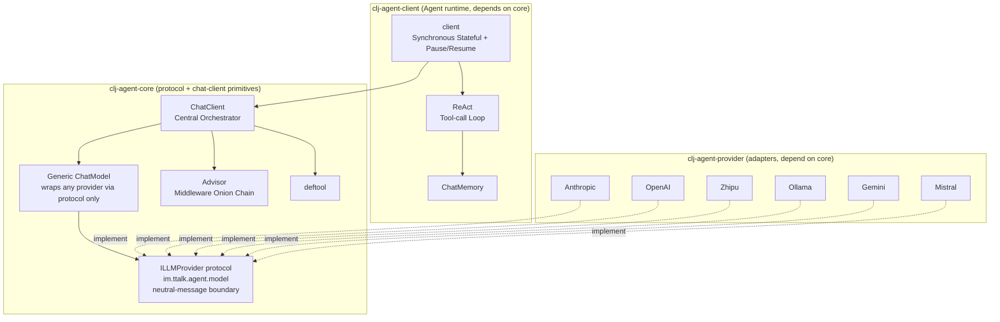
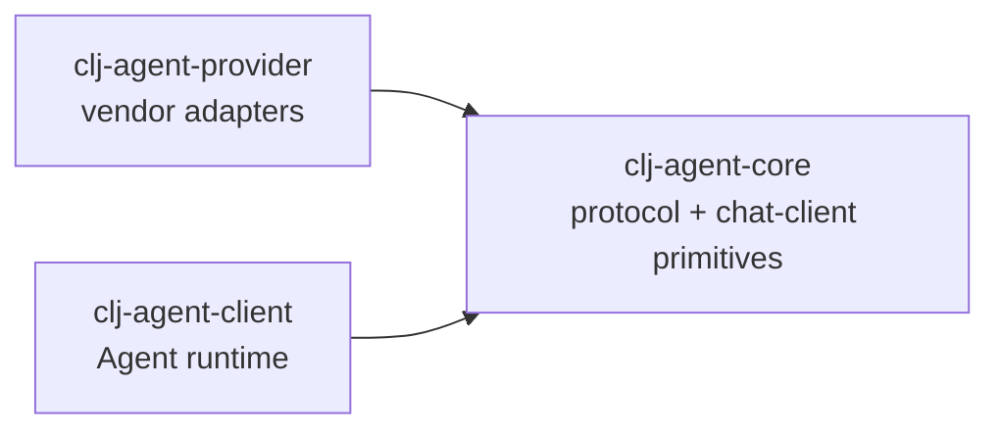

# clj-agent

Clojure AI Agent Framework - ChatClient Central Orchestrator

English | [中文](README.md)

## Overview

`clj-agent` is a Clojure AI Agent framework providing a complete solution from simple conversations to tool-calling agents:

- **ChatClient + Tool Orchestration**: `deftool` macro for tool definitions, `build-chat-client` declaratively registers and schedules them
- **Multi-level Invoke API**: `invoke-tool` (function call), `invoke-chat` (pure LLM); the tool-calling loop is provided by SimpleAgent
- **Filter Middleware**: onion-style around chain (mirrors Spring AI 2.0 Advisor), five hooks — :chat / :tool / :iteration / :turn / :token-xform — can short-circuit/retry/time/recurse
- **Spring AI 2.0 Advisor Alignment**: ToolSearch progressive tool disclosure (78% prompt-token savings measured), return-direct, pluggable loop-continuation predicate, SafeGuard, RAG injection, self-correcting structured output, RE2 — retrieval and vector stores are injected via protocols, so the framework adds zero deps (see `docs/advisor-alignment-design.md`)
- **ChatModel Abstraction**: LLM services via `{:chat-fn :stream-fn}` map, zero coupling
- **Multi-Provider Support**: Anthropic, OpenAI, DeepSeek, Zhipu, Ollama, Gemini, Mistral, MiniMax, DashScope (Alibaba), and OpenAI-compatible protocols
- **SimpleAgent Wrapper**: synchronous stateful conversation with optional pause/resume sensitive-tool approval; LLM/tool errors normalized to `{:status :error}` (configurable `:on-error`)
- **ChatMemory**: per-conversation-id history persistence (in-memory / windowed / SQLite; the SQLite store is `Closeable`)

## Architecture Overview

Dependency Inversion: **Core defines the protocol (port) + chat-client primitives; Client is the Agent runtime; Provider implements the protocol — Client and Provider each depend on Core, not on each other.** Any jar implementing `im.ttalk.agent.model/ILLMProvider` can be injected as a provider.



## Module Dependencies



## Module Structure

```
clj-agent/
├── modules/
│   ├── clj-agent-core/      # Protocol (im.ttalk.agent.model) + chat-client primitives; zero deps
│   ├── clj-agent-client/    # Agent runtime (client/react/memory/subagent), depends on core
│   ├── clj-agent-provider/  # Vendor adapters (im.ttalk.agent.provider.*), implement protocol, depend on core
│   └── clj-agent-agui/      # (optional) Agent runtime backend + AG-UI protocol (im.ttalk.agent.agui.*), depends on core + client
├── examples/              # Usage Examples
├── docs/                  # Design Documents
├── scripts/check_docs.clj # Docs-vs-code gate (JVM Clojure, see below)
├── bb.edn                 # Dev task entry point (`bb tasks` lists them all)
├── build.clj              # Build/release for every module (tools.build)
└── deps.edn               # Root Dependency Configuration
```

## Quick Start

### Add to Your Project

```clojure
;; deps.edn
{:deps {im/ttalk-agent {:local/root "/path/to/clj-agent"}}}
```

### Option 1: SimpleAgent (Recommended for Getting Started)

The simplest way to use the framework with automatic state management:

```clojure
(require '[im.ttalk.agent.simple-agent :as sa])
(require '[im.ttalk.agent.tool :refer [deftool]])
(require '[im.ttalk.agent.provider.factory.builder :as factory])

;; 1. Define tools
(deftool get-weather
  "Get weather information for a city"
  [[city :string "City name"]]
  (str city ": Sunny 25°C"))

;; 2. Create tools collection (tool var vector)
(def my-tools [#'get-weather])

;; 3. Create Provider
(def provider (factory/create-provider-from-env :openai))

;; 4. Create Agent
(def agent (sa/create-agent
             {:provider provider
              :model "gpt-4"
              :system-prompt "You are a weather assistant"
              :tools my-tools}))

;; 5. Chat (auto-accumulates context)
(println (:text (sa/chat agent "What's the weather in Beijing?")))
(println (:text (sa/chat agent "How about Shanghai?")))  ;; remembers context

;; Reset conversation
(sa/reset! agent)
```

### Option 2: SimpleAgent + Sensitive Tool Approval

Configuring `:on-pause` enables pause/resume: the agent automatically pauses when encountering tools marked as `:sensitive`, awaiting human approval:

```clojure
(require '[im.ttalk.agent.simple-agent :as sa])

(deftool delete-file
  "Delete a file"
  [[path :string "File path"]]
  {:sensitive true}   ;; Mark as sensitive operation
  (str "Deleted: " path))

(def file-tools [#'delete-file])

(def agent (sa/create-agent
             {:provider provider
              :model "gpt-4"
              :tools file-tools
              :on-pause (fn [{:keys [reason]}]
                          (println "Approval needed:" reason))}))   ;; enables pause/resume

(let [result (sa/chat agent "Delete /tmp/test.txt")]
  (when (= :paused (:status result))
    (println "Pending tool:" (get-in result [:pending-tool :name]))
    ;; Approve
    (sa/resume agent "approved")
    ;; Or reject: (sa/resume agent "rejected")
    ))
```

### Option 3: ChatClient API (Full Control)

Use the ChatClient directly for maximum flexibility:

```clojure
(require '[im.ttalk.agent.chat-client :as chat-client])
(require '[im.ttalk.agent.tool-registry :as registry])
(require '[im.ttalk.agent.filter :as filters])
(require '[im.ttalk.agent.filter :as flt])
(require '[im.ttalk.agent.chat-model :as chat-model])

;; Create the ChatModel (generic: wraps any provider via protocol only)
(def cm (chat-model/create-chat-model
          provider
          {:model "gpt-4"
           :max-tokens 4096}))

;; Build the ChatClient (declarative; chat-client provides only the primitives: invoke-chat / invoke-tool)
(def cc
  (chat-client/build-chat-client
    {:chat-model cm
     :tools      my-tools                 ;; vector of tool vars
     :filters    [filters/logging-filter]}))

;; Pure LLM call (:chat filter chain, no tool invocation)
(let [{:keys [response]} (chat-client/invoke-chat cc
                           [{:role "user" :content "Hello"}]
                           {})]
  (println (:text response)))

;; Direct tool invocation (:tool filter chain)
(let [{:keys [value]} (chat-client/invoke-tool cc :get-weather
                        {:city "Beijing"} nil)]
  (println value))

;; The full tool-calling loop is SimpleAgent's job (see Option 1 above), not the chat-client:
;; (require '[im.ttalk.agent.simple-agent :as agent])
;; (agent/chat (agent/create-agent {:provider provider :tools my-tools}) "What's the weather in Beijing?")
```

## Core Concepts

### deftool Macro

Simultaneously defines a Clojure function and generates an LLM tool schema:

```clojure
(deftool fn-name
  "Description (becomes the LLM tool description)"
  [[param1 :string "Parameter description"]
   [param2 :int "Optional parameter" :default 10]
   [param3 :boolean "Boolean parameter"]]
  {:sensitive true    ;; Optional: mark as sensitive (SimpleAgent pauses for approval when :on-pause is set)
   :context true}     ;; Optional: needs Context access (adds ctx parameter to function signature)
  (body ...))

;; Supported parameter types: :string :int :float :boolean :array :object
```

### ChatClient API

ChatClient provides three categories of APIs:

```clojure
;; Build API - declarative ChatClient construction
(chat-client/build-chat-client
  {:chat-model cm                       ;; the ChatModel
   :tools      my-tools                 ;; vector of tool vars
   :filters    [filter-def]             ;; filter list
   :settings   {:max-tool-iterations 10}})

;; Invoke API - two primitives (both through the filter onion chain)
(chat-client/invoke-tool cc :fn-name {:arg "val"} context)  ;; Function call (:tool chain)
(chat-client/invoke-chat cc messages opts)                  ;; Pure LLM (:chat chain, no tool loop)
;; The tool-calling loop is NOT in the chat-client — see im.ttalk.agent.simple-agent (create-agent + chat)

;; Tool declaration queries — they live in tool-registry
(registry/tool-schemas cc)        ;; All tool schemas (was (:tools cc))
(:tool-registry cc)               ;; The ToolRegistry record itself
(:chat-model cc)                  ;; Get the ChatModel
(registry/find-function cc :name) ;; Find function
(registry/list-functions cc)      ;; List all function names
(registry/tool-meta cc :name)     ;; ToolMeta record, or nil when unregistered

;; Filter chain access — lives in the filter ns
(flt/filter-hooks cc)             ;; The four pre-compiled chains
(flt/with-filters cc fs)          ;; Swap the chain and recompile hooks
```

Or go through the Facade (`im.ttalk.agent`, mirroring beamai's `beamai.erl`) — the
common API in one place, every function a one-line forward:

```clojure
(require '[im.ttalk.agent :as ai])

(ai/deftool get-weather "Get weather" [[city :string "City"]] (str city ": sunny 25C"))

(def cc (ai/chat-client {:chat-model (ai/chat-model provider {:model "gpt-4"})
                         :tools      [#'get-weather]}))
(ai/chat cc [{:role :user :content "Weather in Beijing?"}])
(ai/invoke-tool cc :get-weather {:city "Beijing"})
```

### ChatModel Interface

The abstraction for **one LLM call** (mirroring Spring AI's `ChatModel`). The split
rule is "would you rewrite it for another provider?": wire format yes, backoff policy
no — so the Provider only handles "how to send this one request", while option
merging, **retry**, and response normalization belong to the ChatModel.

```clojure
(defprotocol IChatModel
  (call        [this request])           ;; ChatRequest -> ChatResponse, retries built in
  (stream-call [this request on-token])  ;; -> ChatResponse, does NOT retry
  (model-options [this]))

(def cm (chat-model/create-chat-model provider
          {:model "gpt-4" :max-tokens 4096
           :retry {:max-retries 3}}))     ;; defaults to 2; :retry false disables
```

Two implementations: `DefaultChatModel` (wraps an `ILLMProvider`) and `FnChatModel`
(wraps `{:chat-fn :stream-fn}` closures). **The historical bare-map form still works** —
`build-chat-client` normalizes `:chat-model` through `as-chat-model`.

#### Retry

Retry sits **below the entire filter stack** (same trade-off as beamai's
`beamai_chat_model`): a filter must see *one logical call*. If retry lived above the
chain, a single network blip would make the memory filter write the same turn's delta
twice — with no runtime symptom. Use the `:on-retry` callback to observe real attempts.

- **Criterion**: the canonical error's `:retryable?` (401 never retries; 429/5xx/connect
  failures do)
- **`Retry-After`**: honored when the server sends it, but capped by `:max-delay`
- **Three-level resolution**: per-call opts > provider config > framework default;
  `:max-retries 0` disables
- **Streaming does not retry**: tokens have already reached the sink; re-running would
  show duplicates downstream. Retry a whole turn at the turn layer instead.

### Request / Response Types (two layers)

```clojure
ChatClientRequest{:request ChatRequest, :context Context, :on-token f}   ;; what the filter chain sees
                   └───────┬────────┘
ChatRequest{:messages [...], :options {...}}                            ;; what the ChatModel sees
```

The extra layer holds `:context` (request-scoped shared state) and `:on-token` (the
streaming sink) — neither is ever sent to the provider. Merging them into one type
would mean filtering "what must not go out" from "what must" with a whitelist; two
layers make the whitelist unnecessary, so provider-specific params pass through intact.

### Filter Middleware (onion-style around, mirrors Spring AI 2.0 Advisor)

The root abstraction is `around(req, chain)`: the filter holds the downstream `chain`
and decides whether/when/how many times to call it (short-circuit / retry / recurse).
A filter carries any of five hooks; execution order is simply the `:filters` vector
order (no `:order`/`:phase`) — earlier = outer. The four around chains, outermost first:
`:turn` > `:iteration` > `:chat` / `:tool`.

```clojure
;; Custom filter — create-filter yields a Filter record; a plain map works too
;; (build-chat-client normalizes it via as-filter, so the two are equivalent)
(filters/create-filter :my-filter
  :chat (fn [req chain] (chain (update req :messages conj sys-msg)))
  :tool (fn [req chain]
          (println "Before tool call:" (get-in req [:function :name]))
          (chain req)))               ;; not calling chain => short-circuit

;; :iteration — sees what this round's tools returned (:chat only sees the LLM half)
(filters/create-filter :round-budget
  :iteration (fn [req chain]          ;; req: {:messages :context :index :remaining}
               (let [t0 (System/currentTimeMillis)
                     r  (chain req)]  ;; r: {:status :continue :messages :context}
                 (println "round" (:index req) "took"
                          (- (System/currentTimeMillis) t0) "ms")
                 r)))                 ;; :paused / :cancelled must pass through untouched

;; The five hooks:
;;   :chat        one LLM call    (each round inside the tool loop; memory lives here)
;;   :tool        one tool call   (applies inside each parallel task)
;;   :iteration   one round = LLM call + that round's tool batch (same cadence as
;;                :chat, but it sees what the tools returned; may re-enter to rerun the round)
;;   :turn        the whole tool loop (once per turn; may call (chain req) again to recurse)
;;   :token-xform outbound streaming token transform (a transducer, not an around fn)

;; Built-in filters
filters/logging-filter          ;; :tool  pre/post-call logging
(filters/logging-chat-filter)   ;; :chat  LLM request/response logging (~ SimpleLoggerAdvisor)
;; Timeouts are not a filter: deftool {:timeout ms} or an engine-level
;; (…-tool-calling-manager {:timeout ms}) just works (declaration wins; no default otherwise)
(filters/approval-filter)       ;; :tool  sensitive-tool approval (short-circuits on reject)
(filters/validation-turn-filter validate-fn :max-retries 2)
                                ;; :turn  validate the final answer; re-enter with feedback
(filters/safeguard-turn-filter ["badword"])
                                ;; :turn  block before the loop even starts (~ SafeGuardAdvisor)
(filters/re-reading-filter)     ;; :turn  RE2 re-reading (~ ReReadingAdvisor)

;; Standalone advisor namespaces (Spring AI 2.0 alignment)
im.ttalk.agent.filter.tool-search        ;; progressive tool disclosure (~ ToolSearchToolCallingAdvisor)
im.ttalk.agent.filter.structured-output  ;; JSON-Schema validator (~ StructuredOutputValidationAdvisor)
im.ttalk.agent.filter.rag                ;; retrieval injection (~ QuestionAnswerAdvisor)
```

Retrieval/vector stores are never bundled — they are injected through the
`IToolIndex` / `IRetriever` protocols, so the framework keeps zero extra deps.
Full alignment record: `docs/advisor-alignment-design.md`; mechanism contracts:
`docs/filter-chain-design.md`.

**Chains are compiled at assembly time.** `build-chat-client` pre-folds all four around
chains (stored in the chat-client's `hooks` field) and pre-`comp`s the `:token-xform`
chain, so a call only has to hand the terminal to a ready-made chain builder. To
swap the filters of an existing chat-client use `chat-client/with-filters` — a bare
`(assoc chat-client :filters …)` leaves `hooks` out of sync (`filter-hooks` detects this
and recompiles on the spot, so semantics always follow `:filters`, but you pay for
it on every invoke).

**Tool names must be unique** within a chat-client (across vars, across inline tools, and
between the two); duplicates make `build-chat-client` throw with `{:duplicates [...]}`.
Both schemas would otherwise reach the LLM while only one handler survives — what the
model sees and what actually runs drift apart with no runtime symptom. Illegal
`:timeout` / `:retry` declarations are rejected at assembly time too.

### Async Entry Point (Ring / Luminus async handlers)

`agent/chat-async` returns a `CompletableFuture` immediately and runs the whole turn on a
virtual thread, so an HTTP worker thread is never parked on an LLM round-trip. It lines up
exactly with Ring 3's three-argument async handler:

```clojure
(require '[im.ttalk.agent.async :as async] '[im.ttalk.agent.filter :as flt])

(defn chat-handler [request respond raise]
  (-> (agent/chat-async (session-agent request) (message-of request))
      (flt/fmap ->ring-response)                  ;; response-side combinator; also valid on the sync chain
      (async/on-complete respond raise)))         ;; respond/raise are Ring's own callbacks

["/api/chat" {:post {:handler chat-handler}}]     ;; reitit detects async by arity
```

Also available: `react/invoke-async`, `react/resume-async`, `agent/resume-async` (the second
half of a HITL turn stays non-blocking too), `async/join` to block for a value, and
`async/vthread` to build your own async terminal. Sync and async share **one implementation**
(they differ only in a "runner" argument) and return the same result shape.

**Writing filters**: on the async path `(chain req)` really does return a deferred, so the
response side must go through `flt/fmap` / `flt/fbind`. `(let [r (chain req)] …)` will not
throw — it just silently hands you a future. On the sync chain the combinators are identity
expansions (zero overhead), so always write them that way.

**How deep does async go**: `:turn`, `:iteration` and `:chat` are deferred end to end; the
`:tool` terminal stays synchronous (tools are user code — blocking is the norm, and batches
already run on an executor). Providers that implement the optional `IAsyncLLMProvider`
protocol (Anthropic-family and OpenAI-compatible ones do) use native async HTTP; the rest are
covered by `chat-model/call-async*` on a virtual thread — **every provider can go async**,
implementing the protocol merely saves that thread.

⚠️ **The streaming sink's thread is not guaranteed**: on the async path `on-token` fires on a
worker thread (the sync entry still uses the calling thread). Tokens of one stream are still
delivered serially, so `:token-xform` needs no locking — but a sink that touches UI or a
`ThreadLocal` must hop back itself. See
[`docs/token-stream-filter-design.md`](docs/token-stream-filter-design.md) §2.1.

Why the hooks were *not* split into before/after: see
[`docs/filter-chain-design.md`](docs/filter-chain-design.md) §2.6; the async layer's design
(optional protocols, `retry/run-async`, fallback) is in
[`docs/async-chat-model-design.md`](docs/async-chat-model-design.md). Runnable example (offline,
no API key; concurrency measurement, raise path, HITL):
`examples/async_luminus_handler_example.clj`.

### ToolSearch — Progressive Tool Disclosure (mirrors Spring AI `ToolSearchToolCallingAdvisor`)

Once you have many tools, every round ships the full schema set into the prompt
(Spring measured 28 tools ≈ 5K–17K tokens, and tool-selection accuracy degrades past
30+ similarly-named tools). Progressive disclosure replaces "send everything upfront"
with "retrieve on demand": only a `search_tools` tool is exposed initially, and
whatever the model retrieves enters the tool list on the **next** round.

```clojure
(require '[im.ttalk.agent.filter.tool-search :as ts])

(chat-client/build-chat-client
  (ts/with-tool-search                       ;; wires tool + filter + state-slot in one shot
    {:chat-model cm
     :tools   [#'t1 #'t2 ... #'t80]
     :filters [(ma/memory-filter store)]}
    {:index (ts/keyword-tool-index)          ;; or (ts/regex-tool-index)
     :limit 5
     :always-include #{"handoff"}}))         ;; always-on tools, no search needed
```

The index is **zero-dep and pluggable**: built-in `keyword-tool-index` (name/description
token overlap × IDF, CJK bigram segmentation) and `regex-tool-index` (name patterns);
bring your own vector store by `(reify ts/IToolIndex ...)`. The discovered set rides in
the tool-context, so pause/resume/persistence are correct for free.

Measured at 78% prompt-token savings on a 50-tool catalog — but read
`docs/advisor-alignment-design.md` §2.3–2.5 before adopting: whether it pays depends on
**total schema size** (not tool count), and it can *cost more money* when a static tool
prefix would otherwise be served cheaply from the provider's prompt cache.

### RAG Injection (mirrors Spring AI `QuestionAnswerAdvisor`)

Retrieves once per turn and folds the result into the user's question.
**No vector store is bundled** — retrieval is injected via `IRetriever`:

```clojure
(require '[im.ttalk.agent.filter.rag :as rag])

(def retriever
  (reify rag/IRetriever
    (retrieve [_ query top-k]
      (map (fn [hit] {:text (:content hit)}) (my-vector-store/search query top-k)))))

(chat-client/build-chat-client
  {:chat-model cm
   :filters [(ma/memory-filter store)
             (rag/qa-turn-filter retriever :top-k 4)]})
```

Mounted on `:turn`, so retrieval happens exactly once per turn (a `:chat` filter would
re-retrieve on every round of the tool loop). On an empty retrieval we **skip injection**
— a deliberate divergence from Spring, which injects an empty context plus a "say you
can't answer" instruction and therefore makes the model refuse questions that have
nothing to do with retrieval. Pass `:inject-when-empty? true` for Spring's semantics.

### Structured Output Validation (mirrors Spring AI `StructuredOutputValidationAdvisor`)

`validation-turn-filter` is the **mechanism** (invalid → re-enter with feedback → retry
cap); `filter/structured-output` is the **predicate** (validate against a JSON Schema
and phrase the failure so the model can self-correct, rather than blindly retry):

```clojure
(require '[im.ttalk.agent.filter.structured-output :as so]
         '[cheshire.core :as json])

(filters/validation-turn-filter
  (so/validate-fn {:type "object"
                   :properties {:actor {:type "string"}
                                :films {:type "array" :items {:type "string"}}}
                   :required ["actor" "films"]}
    :parse-fn #(json/parse-string % true))   ;; core has zero deps — you inject the parser
  :max-retries 2)
;; Feedback the model receives: "缺少必填字段 films" / "字段 films[1] 期望 string，实为 integer"
```

Note the self-correction loop only converges if the fix is **achievable by the model** —
a schema demanding information the model cannot know will spin until the retry cap
(which is exactly why exhaustion returns the last result as-is instead of throwing).

### Context (Shared State)

Context manages shared state within a conversation:

```clojure
(require '[im.ttalk.agent.context :as ctx])

(def my-ctx (ctx/create {:user-id "u123"}))    ;; Create (with initial variables)
(ctx/context? my-ctx)                          ;; Predicate
(ctx/get-var my-ctx :user-id)                  ;; Get variable
(ctx/set-var my-ctx :key "value")              ;; Set one variable (returns new ctx)
(ctx/set-vars my-ctx {:a 1 :b 2})              ;; Set multiple (returns new ctx)
(ctx/conversation-id my-ctx)                   ;; Get conversation id
(ctx/with-conversation-id my-ctx "u1")         ;; Set conversation id (returns new ctx)
```

> Conversation history is NOT in Context; it is maintained by a ChatMemory store keyed by conversation-id (see `im.ttalk.agent.memory` / Memory Filter).

## LLM Providers

### Supported Providers

| Provider | Description | Environment Variable |
|----------|-------------|---------------------|
| `:openai` | OpenAI GPT series | `OPENAI_API_KEY` |
| `:anthropic` | Anthropic Claude series | `ANTHROPIC_API_KEY` |
| `:zhipu` | Zhipu GLM series | `ZHIPU_API_KEY` |
| `:ollama` | Local Ollama models | - |
| `:gemini` | Google Gemini (OpenAI-compatible endpoint) | `GOOGLE_API_KEY` |
| `:mistral` | Mistral | `MISTRAL_API_KEY` |
| `:deepseek` | DeepSeek | `DEEPSEEK_API_KEY` |
| `:minimax` | MiniMax (Anthropic-compatible endpoint) | `MINIMAX_API_KEY` |
| `:dashscope` | Alibaba DashScope (native SSE streaming) | `DASHSCOPE_API_KEY` |
| `:openai-compat` | OpenAI-compatible protocol | Custom |

> Advanced per-provider capabilities (structured output, parallel tool calls,
> `reasoning_effort`, Anthropic prompt caching / web_search / citations / skills,
> DeepSeek reasoning & prefix completion, etc.) are documented in the
> [`clj-agent-provider` README](modules/clj-agent-provider/README.md). All providers
> support both **sync** and **streaming (SSE)** — including DashScope's native SSE
> (`X-DashScope-SSE` + `incremental_output`). If a provider doesn't support streaming,
> the chat-model auto-falls back to sync and emits the full text as a single token.

### Creating Providers

```clojure
(require '[im.ttalk.agent.provider.factory.builder :as factory])

;; Auto-configure from environment variables
(def provider (factory/create-provider-from-env :openai))

;; Manual configuration
(def provider (factory/create-provider :anthropic
                {:api-key "sk-..."
                 :base-url "https://api.anthropic.com"}))

;; OpenAI-compatible protocol (e.g., vLLM, LocalAI)
(def provider (factory/create-provider :openai-compat
                {:api-key "key"
                 :base-url "http://localhost:8000/v1"}))
```

## Development

Dev tasks all go through [babashka](https://babashka.org/) (`bb tasks` lists them all):

```bash
bb test          # test all three modules; `bb test core` for just one
bb check-docs    # docs-vs-code gate (ghost APIs / missing index entries)
bb check         # test + check-docs — run this before committing

bb jar           # jar all three modules; `bb jar core` for just one
bb install       # install into the local ~/.m2
bb release       # per module: clean → jar → install (full pre-release flow)
bb deploy        # push to Clojars (needs CLOJARS_USERNAME / CLOJARS_PASSWORD)
bb version       # current version (0.3.<git-count-revs>)

bb repl                       # REPL with all module sources on the classpath
bb repl simpleagent_examples  # load an example first, then drop into the REPL
```

The build itself lives in the root `build.clj` (tools.build) — `bb` is just the entry
point, `clojure -T:build jar :module core` works too. All three modules share one build:
same pom-data, same `0.3.<git-count>` version scheme, switched per module via
`b/set-project-root!`.

> **Why core must be installed before client/provider are jarred**: their `deps.edn`
> declares core as `{:local/root ".."}`, and `write-pom` can't turn a local path into a
> valid Maven coordinate — left alone, the generated pom would **omit the core
> dependency** and break resolution for consumers. The build overrides it to the
> same-version `:mvn/version` via an alias, which requires that core already be in the
> local repo. `bb release` satisfies this by going clean→jar→install per module; a bare
> `bb jar client` auto-installs core first.

<!-- check-docs:ignore-start -->
### Docs-vs-code gate (`scripts/check_docs.clj`)

A sweep once found a pile of **ghost APIs** across the six READMEs — features long
removed or renamed, sometimes with an "already removed" note sitting right there in
the source, while the docs happily kept teaching them. Worst case: `:build-result-msgs`
was documented in four READMEs' **headline feature bullet** while `chat_model.clj`
explicitly said it was gone. Human review doesn't catch this, so it's mechanized:

| Check | Catches |
|---|---|
| **ns exists** | every `im.ttalk.agent.*` named in a README must exist (caught `model.types`, which never existed) |
| **ns coverage** | every source ns must be mentioned by some README (caught `pause` / `timeline` / `dashscope` — whole features invisible in the index) |
| **symbol resolve** | `alias/sym` in code blocks must resolve (caught `proto/call-with-tools` — no such protocol method) |
| **tombstones** | removed APIs must not come back. Map keys and macro options can't be resolved, so they're listed explicitly — **add an entry when you remove an API** |

Design bias: **prefer false negatives over false positives.** An alias not bound by a
`require` in the same file is skipped (so Spring class names, `my-vector-store/search`
placeholders and `scripts/check_docs.clj` paths never participate); comments and string
literals are stripped first (otherwise "pause/resume" in a comment and the URL
`/anthropic/v1/messages` in a string both misfire). *A gate that cries wolf gets
`|| true`'d within a week.*

### Live Verification Scripts (real provider)

The unit suite (293 tests / 1198 assertions) touches no network. But some properties
**a unit test cannot prove** — "will the model actually fix itself when handed the
validation error?", "does the answer come from retrieval or from prior knowledge?",
"do we really save tokens?" — only a real model can answer those. That's what these
are for (**88 assertions** total):

| Script | Asserts | What only it can prove |
|---|---|---|
| `examples/toolsearch_live_test.clj` | 11 | **78% prompt-token savings** on a 50-tool catalog with no loss of task quality; plus a cold/warm cache cost comparison — **saving tokens ≠ saving money** |
| `examples/rag_live_test.clj` | 18 | corpus is entirely **fabricated facts** → control group can't answer, RAG group can — proving **grounding really comes from retrieval** |
| `examples/structured_output_live_test.clj` | 12 | hand "missing required field birth_year" back to a real model and **it actually adds the field** (self-correction isn't just a claim) |
| `examples/safeguard_live_test.clj` | 18 | a blocked turn makes **zero LLM calls**; the cost of not persisting is visible across real turns; boundary — a sensitive word in a *tool result* passes (**entry guard ≠ output guard**) |
| `examples/return_direct_live_test.clj` | 19 | **control group**: the same compliance text goes through verbatim with return-direct, but gets rewritten by the model via a normal tool; the persistence fix verified with a real second turn |
| `examples/minimax_agent_live_test.clj` | — | 9 callbacks / custom memory & chat-client / `:filters` not exposed |
| `examples/release_consumer_live_test.clj` | 10 | **consumer's view**: deps declare only client + provider, so core *must* arrive transitively via the pom; asserts the classpath holds jars rather than source dirs, then makes a real tool-calling round-trip. The unit suite runs on a source classpath and knows **nothing** about jars/poms — a pom missing its core dependency only shows up in someone else's project (run `bb release` first) |

```bash
export MINIMAX_API_KEY=...        # legacy name MINIMAX_AUTH_TOKEN also accepted
clojure -M -e '(load-file "examples/toolsearch_live_test.clj")'
```

These bill real tokens. Exit 0 on success, 1 on failure (CI-able, but needs a key).

**The rule for live assertions**: pin the **mechanism** (LLM call counts, the messages
and tool set actually sent, the persisted shape) — never the model's wording, which
fluctuates and would turn CI into a minefield. The model's actual replies are printed,
not asserted. Where a branch depends on "did the model happen to comply on the first
try", use a **conditional assertion** (decide from the first output, then assert the
matching invariant) — both paths test the mechanism and neither flakes.

<!-- check-docs:ignore-end -->

## Dependencies

Core:

- org.clojure/clojure 1.11.4
- cheshire/cheshire 5.12.0 (provider, JSON)
- com.taoensso/timbre 6.3.0 (client / provider, logging)

> The core module has zero external deps; HTTP uses the JDK's built-in java.net.http.

Persistent ChatMemory (client module, SQLite backend, opt-in via `im.ttalk.agent.memory.sqlite`):

- com.github.seancorfield/next.jdbc 1.3.939
- org.xerial/sqlite-jdbc 3.45.1.0

Testing:

- lambdaisland/kaocha 1.85.1342

## License

MIT License
