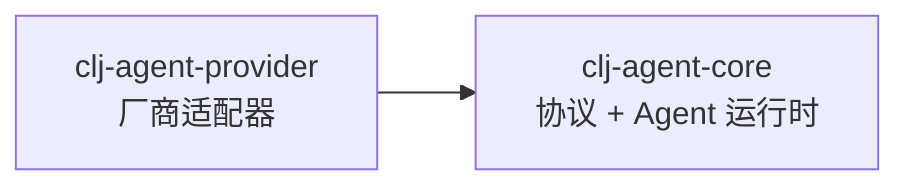

# clj-agent 多模块项目

## 模块结构

clj-agent 采用**依赖倒置(DIP)**的三层划分:**Core 定义协议(端口)+ kernel 原语;Provider 实现协议(适配器);Client 是 Agent 运行时(循环/记忆/门面)。** 任何实现了 `im.ttalk.agent.model/ILLMProvider` 的 jar 都能作为 provider 注入 agent。

```
clj-agent/
├── modules/
│   ├── clj-agent-core/      # 协议(端口) + kernel 原语;零依赖
│   ├── clj-agent-client/    # Agent 运行时(client/react/memory/subagent),依赖 core
│   └── clj-agent-provider/  # 各厂商适配器(实现协议),依赖 core
├── scripts/
└── deps.edn                 # 根配置(开发/测试一次性加载全部模块)
```

依赖方向:**Provider → Core ← Client**(实现与运行时各自依赖抽象,互不依赖)。应用层在运行时构造一个 provider 注入 agent。

---

## 模块说明

### 1. clj-agent-core — 协议 + kernel 原语

**职责**: 定义 LLM 抽象契约(端口)与 kernel 编排原语。**不依赖任何 provider 实现,对记忆/循环零感知**。

**契约 / 端口**(`im.ttalk.agent.model.*`):
- `im.ttalk.agent.model` — `ILLMProvider` 协议(≈ Spring AI `ChatModel`),以**中立消息**为边界
- `im.ttalk.agent.model.message` / `.response` / `.error` / `.types` — 中立消息、统一响应、错误、构造器
- `im.ttalk.agent.model.service` — **通用** `create-service`:仅凭协议把任意 provider 包成 kernel service

**Kernel 原语**:
- `im.ttalk.agent.kernel` - Kernel（build-kernel / invoke-chat / invoke-tool）
- `im.ttalk.agent.tool` - deftool 宏（≈ `ToolCallback`）
- `im.ttalk.agent.advisor` - Advisor 洋葱链执行器（≈ `CallAdvisorChain`）
- `im.ttalk.agent.context` - 请求级上下文
- `im.ttalk.agent.streaming` - 流式取消令牌

**依赖**: 无（纯 Clojure）

---

### 1.5 clj-agent-client — Agent 运行时

**职责**: 在 core 原语之上构建 Agent 运行时（2026-07 自 core 下沉，命名空间不变）。

- `im.ttalk.agent.client` - 高级 Agent API（≈ `ChatClient`）
- `im.ttalk.agent.react` - ReAct 工具调用循环
- `im.ttalk.agent.memory` / `.memory.sqlite` - ChatMemory
- `im.ttalk.agent.advisor.memory` - 记忆 advisor（≈ `MessageChatMemoryAdvisor`）
- `im.ttalk.agent.callbacks` - 生命周期回调
- `im.ttalk.agent.subagent.*` - 子 agent 体系
- `im.ttalk.agent.common` - 共享 Kernel 构建

**依赖**: `clj-agent-core`; timbre, next.jdbc, sqlite-jdbc

---

### 2. clj-agent-provider — 厂商适配器

**职责**: 实现 `im.ttalk.agent.model/ILLMProvider`;`call-llm` 收**中立消息**、内部转各厂商 wire 格式再请求 API。

**包含**（`im.ttalk.agent.provider.*`）:
- `im.ttalk.agent.provider.{openai,anthropic,zhipu,ollama,gemini,mistral,deepseek,minimax,dashscope,openai-compat-provider,mock}` - 各 provider 实现
- `im.ttalk.agent.provider.common.{base,openai-compat,cache,response-parser}` - 辅助层：provider 基座/OpenAI 协议层/Anthropic 缓存策略/响应解析
- `im.ttalk.agent.provider.{wire,schema,stream}.*` - wire 格式 / 工具 schema / 流式解析（provider 内部）
- `im.ttalk.agent.provider.http.{client,retry}` - HTTP 客户端 / 重试与错误分类
- `im.ttalk.agent.provider.factory.*` - Provider 注册/配置/创建
- `im.ttalk.agent.provider.api` - Provider 统一门面

**依赖**: `clj-agent-core`(协议/契约), cheshire, timbre（HTTP 走 JDK 内置 java.net.http，零额外依赖）

---

## 使用方法

### 方式 1: 根目录开发（推荐）

```bash
clojure -M:test          # 运行所有测试
```

### 方式 2: 单模块开发

```bash
cd modules/clj-agent-core
clojure -M:dev
clojure -M:test
```

---

## 依赖关系



> 第三方只需依赖 `clj-agent-core`、实现 `im.ttalk.agent.model/ILLMProvider`，即可作为 provider 被 agent 使用。
