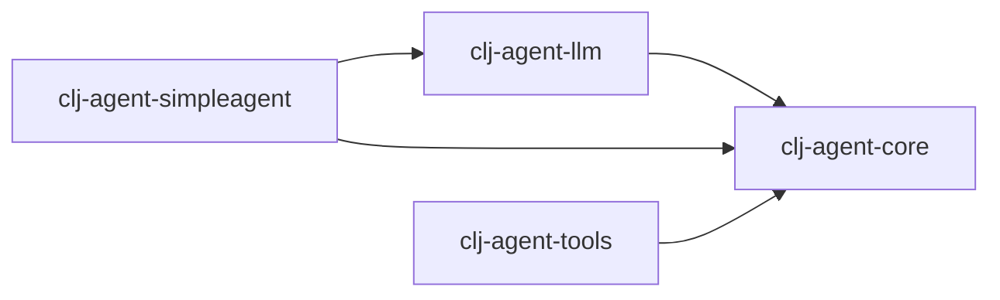

# clj-agent 多模块项目

## 模块结构

clj-agent 分为多个独立模块：

```
clj-agent/
├── modules/
│   ├── clj-agent-core/         # 核心框架（Kernel, Tool, Filter, deftool, Process Runtime）
│   ├── clj-agent-llm/          # LLM Provider + Service 工厂
│   ├── clj-agent-simpleagent/  # 高级 Agent 封装（KernelAgent, ProcessAgent）
│   └── clj-agent-tools/       # 预置插件库（File, HTTP, Shell）
├── scripts/                     # 构建脚本
└── deps.edn                     # 根配置
```

---

## 模块说明

### 1. clj-agent-core

**职责**: Kernel 编排器、工具系统、Process 运行时

**包含**:
- `im.ttalk.agent.core.kernel` - Kernel（Build/Invoke/Query API）
- `im.ttalk.agent.core.kernel.tool` - deftool 宏（工具函数定义 + schema 生成）
- `im.ttalk.agent.core.kernel.filter` - Filter 拦截链（Ring-style 中间件）
- `im.ttalk.agent.core.kernel.context` - Context 共享状态管理
- `im.ttalk.agent.core.kernel.process.*` - 事件驱动 Process 运行时
- `im.ttalk.agent.core.http.client` - HTTP 客户端

**依赖**: core.async, cheshire, timbre, http-kit

---

### 2. clj-agent-llm

**职责**: LLM Provider 实现 + Service 工厂

**包含**:
- `im.ttalk.agent.llm.factory.builder` - Provider 创建（手动/环境变量/自动）
- `im.ttalk.agent.llm.factory.registry` - Provider 注册表
- `im.ttalk.agent.llm.factory.config` - 配置管理
- `im.ttalk.agent.llm.kernel.chat` - Service 工厂（create-service）
- `im.ttalk.agent.llm.provider.*` - Provider 实现（OpenAI, Anthropic, Zhipu, Ollama, Gemini, Mistral）
- `im.ttalk.agent.llm.schema.*` - 请求 Schema 转换
- `im.ttalk.agent.llm.stream.*` - 流式响应解析

**依赖**: `clj-agent-core`, openai-clojure, clj-http

---

### 3. clj-agent-simpleagent

**职责**: 开箱即用的 Agent 封装

**包含**:
- `im.ttalk.agent.simpleagent.kernel-agent` - KernelAgent（同步有状态）
- `im.ttalk.agent.simpleagent.process-agent` - ProcessAgent（pause/resume 审批）
- `im.ttalk.agent.simpleagent.common` - 共享构建逻辑

**依赖**: `clj-agent-core`, `clj-agent-llm`

---

### 4. clj-agent-tools

**职责**: 预置工具插件库

**包含**:
- `im.ttalk.agent.tools.file` - 文件操作（read, write, delete, copy, move）
- `im.ttalk.agent.tools.http` - HTTP 请求（GET, POST, PUT, DELETE）
- `im.ttalk.agent.tools.shell` - Shell 命令（安全/非安全模式）
- `im.ttalk.agent.tools.security` - 安全工具
- `im.ttalk.agent.tools.resilience` - 重试/超时

**依赖**: `clj-agent-core`

---

## 使用方法

### 方式 1: 根目录开发（推荐）

在根目录开发，可以同时加载所有模块：

```bash
# 运行所有测试
clojure -M:test
```

### 方式 2: 单模块开发

在单个模块目录中开发：

```bash
cd modules/clj-agent-core
clojure -M:dev
clojure -M:test
```

---

## 构建和发布

```bash
./scripts/build-all.sh      # 构建所有模块
./scripts/install-all.sh    # 安装到本地 Maven
./scripts/test-all.sh       # 测试所有模块
```

---

## 依赖关系


