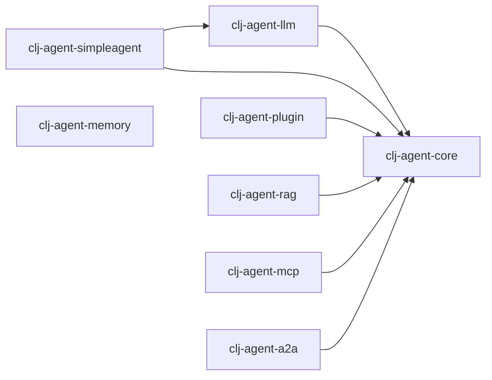

# clj-agent 多模块项目

## 模块结构

clj-agent 分为多个独立模块：

```
clj-agent/
├── modules/
│   ├── clj-agent-core/         # 核心框架（Kernel, Plugin, Filter, deftool, Process Runtime）
│   ├── clj-agent-llm/          # LLM Provider + Service 工厂
│   ├── clj-agent-simpleagent/  # 高级 Agent 封装（KernelAgent, ProcessAgent）
│   ├── clj-agent-plugin/       # 预置插件库（File, HTTP, Shell）
│   ├── clj-agent-memory/       # 记忆系统（Store, SnapshotStore, 长短期记忆）
│   ├── clj-agent-rag/          # RAG 检索增强生成
│   ├── clj-agent-mcp/          # MCP 服务器/客户端
│   └── clj-agent-a2a/          # A2A 服务器/客户端
├── scripts/                     # 构建脚本
└── deps.edn                     # 根配置
```

---

## 模块说明

### 1. clj-agent-core

**职责**: Kernel 编排器、工具系统、Process 运行时

**包含**:
- `im.ttalk.agent.core.kernel.core` - Kernel（Build/Invoke/Query API）
- `im.ttalk.agent.core.kernel.tool` - deftool 宏（工具函数定义 + schema 生成）
- `im.ttalk.agent.core.kernel.plugin` - KernelPlugin（defplugin + 工具管理）
- `im.ttalk.agent.core.kernel.filter` - Filter 拦截链（Ring-style 中间件）
- `im.ttalk.agent.core.kernel.context` - Context 共享状态管理
- `im.ttalk.agent.core.kernel.process.*` - 事件驱动 Process 运行时
- `im.ttalk.agent.core.http.client` - HTTP 客户端

**依赖**: core.async, cheshire, timbre, http-kit

---

### 2. clj-agent-llm

**职责**: LLM Provider 实现 + Service 工厂

**包含**:
- `im.ttalk.agent.llm.factory.builder` - Provider 创建（手动/环境变量/自动）
- `im.ttalk.agent.llm.factory.registry` - Provider 注册表
- `im.ttalk.agent.llm.factory.config` - 配置管理
- `im.ttalk.agent.llm.kernel.chat` - Service 工厂（create-service）
- `im.ttalk.agent.llm.provider.*` - Provider 实现（OpenAI, Anthropic, Zhipu, Ollama, Gemini, Mistral）
- `im.ttalk.agent.llm.schema.*` - 请求 Schema 转换
- `im.ttalk.agent.llm.stream.*` - 流式响应解析

**依赖**: `clj-agent-core`, openai-clojure, clj-http

---

### 3. clj-agent-simpleagent

**职责**: 开箱即用的 Agent 封装

**包含**:
- `im.ttalk.agent.simpleagent.kernel-agent` - KernelAgent（同步有状态）
- `im.ttalk.agent.simpleagent.process-agent` - ProcessAgent（pause/resume 审批）
- `im.ttalk.agent.simpleagent.common` - 共享构建逻辑

**依赖**: `clj-agent-core`, `clj-agent-llm`

---

### 4. clj-agent-plugin

**职责**: 预置工具插件库

**包含**:
- `im.ttalk.agent.plugin.file` - 文件操作（read, write, delete, copy, move）
- `im.ttalk.agent.plugin.http` - HTTP 请求（GET, POST, PUT, DELETE）
- `im.ttalk.agent.plugin.shell` - Shell 命令（安全/非安全模式）
- `im.ttalk.agent.plugin.security` - 安全工具
- `im.ttalk.agent.plugin.resilience` - 重试/超时

**依赖**: `clj-agent-core`

---

### 5. clj-agent-memory

**职责**: 记忆与存储系统

**包含**:
- `im.ttalk.agent.memory.store.*` - 存储后端（InMemory, SQLite, PostgreSQL, Redis）
- `im.ttalk.agent.memory.snapshot.*` - 快照管理（StoreBackedSnapshotStore, Manager）
- `im.ttalk.agent.memory.short-term.buffer` - 对话缓冲
- `im.ttalk.agent.memory.long-term.*` - 长期记忆（Semantic, Episodic, Procedural）
- `im.ttalk.agent.memory.agent-memory` - AgentMemory 统一封装

**依赖**: 无内部依赖（独立模块）

---

### 6. clj-agent-rag

**职责**: RAG 检索增强生成

**包含**:
- `im.ttalk.agent.rag.plugin` - RAG 工具集（Kernel Plugin）
- `im.ttalk.agent.rag.pipeline` - RAG 执行管道
- `im.ttalk.agent.rag.splitter` - 文本切分
- `im.ttalk.agent.rag.embeddings` - Embedding 操作
- `im.ttalk.agent.rag.vector_store` - 向量存储

**依赖**: `clj-agent-core`

---

### 7. clj-agent-mcp

**职责**: MCP (Model Context Protocol) 服务器/客户端

**包含**:
- `im.ttalk.agent.mcp.registry` - 状态管理（工具/资源/提示词注册）
- `im.ttalk.agent.mcp.handler` - 纯函数处理层 + Ring 适配器
- `im.ttalk.agent.mcp.server.core` - MCP 服务器生命周期
- `im.ttalk.agent.mcp.client.core` - MCP 客户端
- `im.ttalk.agent.mcp.transport.*` - Stdio/SSE 传输
- `im.ttalk.agent.mcp.protocol` - MCP 协议定义
- `im.ttalk.agent.mcp.json_rpc` - JSON-RPC 消息处理

**依赖**: http-kit, cheshire

---

### 8. clj-agent-a2a

**职责**: A2A (Agent-to-Agent Protocol) 服务器/客户端

**包含**:
- `im.ttalk.agent.a2a.types` - 核心类型（Message, Task, Artifact, AgentCard）
- `im.ttalk.agent.a2a.json_rpc` - JSON-RPC 2.0 实现
- `im.ttalk.agent.a2a.task` - 任务生命周期管理
- `im.ttalk.agent.a2a.card` - Agent Card 生成
- `im.ttalk.agent.a2a.handler` - 状态管理 + 纯函数处理层 + Ring 适配器
- `im.ttalk.agent.a2a.server.core` - A2A 服务器生命周期
- `im.ttalk.agent.a2a.client` - A2A 客户端

**依赖**: http-kit, cheshire, clj-uuid

---

## 使用方法

### 方式 1: 根目录开发（推荐）

在根目录开发，可以同时加载所有模块：

```bash
# 运行所有测试
clojure -M:test

# 启动 MCP 服务器
clojure -M:mcp-server
```

### 方式 2: 单模块开发

在单个模块目录中开发：

```bash
cd modules/clj-agent-core
clojure -M:dev
clojure -M:test
```

---

## 构建和发布

```bash
./scripts/build-all.sh      # 构建所有模块
./scripts/install-all.sh    # 安装到本地 Maven
./scripts/test-all.sh       # 测试所有模块
```

---

## 依赖关系



`clj-agent-memory` 是独立模块，无内部依赖。
